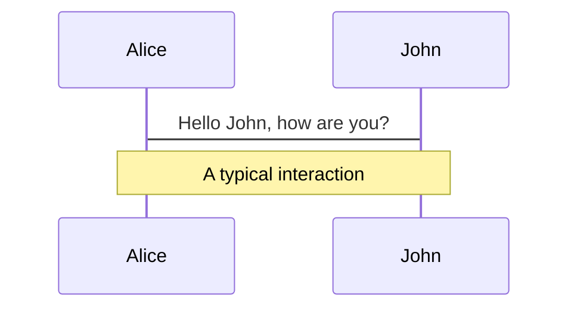
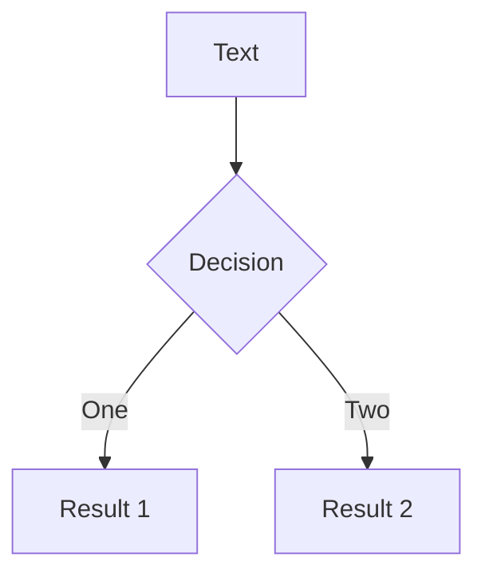
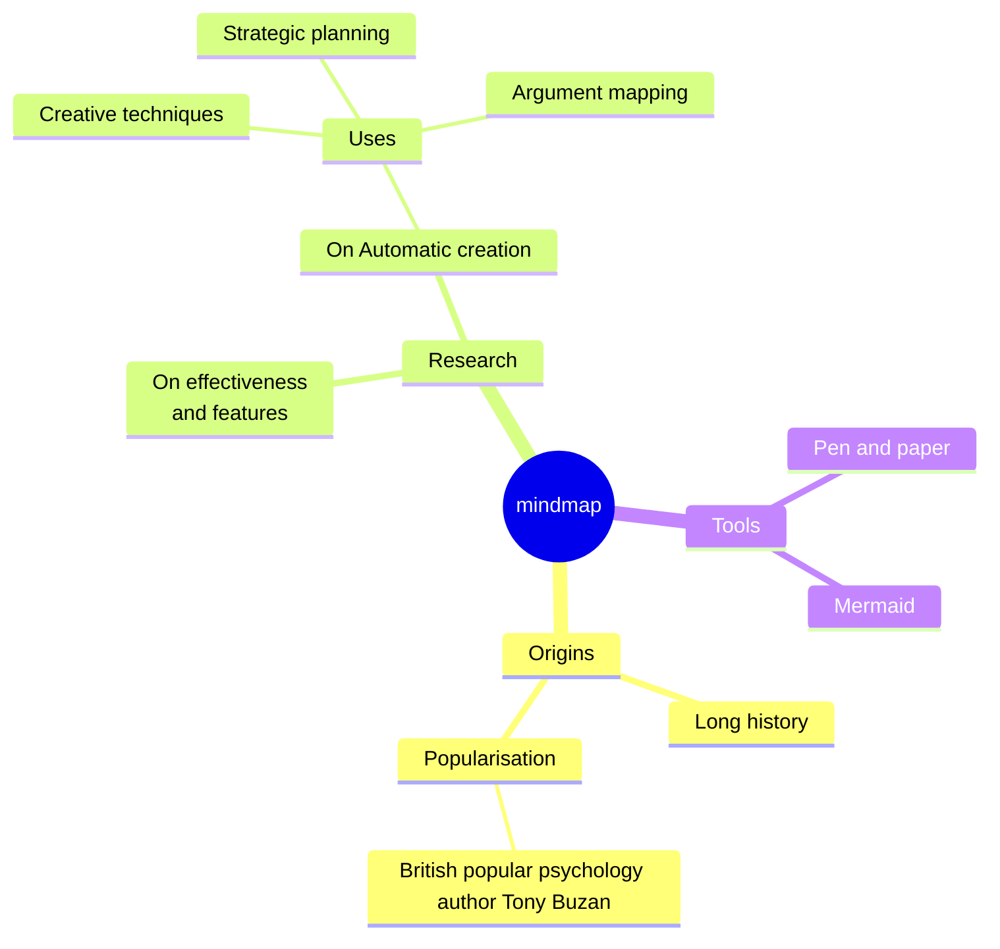
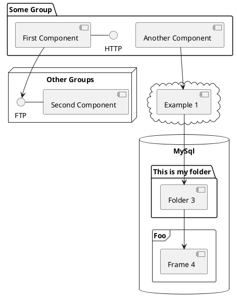

---
# try also 'default' to start simple
theme: dracula
title: 首页
info: |
  ## Slidev Starter Template
  Presentation slides for developers.

  Learn more at [Sli.dev](https://sli.dev)
# apply UnoCSS classes to the current slide
layout: cover
class: bg-blend-overlay bg-black65
# https://sli.dev/features/drawing
drawings:
  persist: false
# slide transition: https://sli.dev/guide/animations.html#slide-transitions
transition: slide-left
# enable MDC Syntax: https://sli.dev/features/mdc
mdc: true
# duration of the presentation
duration: 35min
---

<div class="center">
  	<h1 class="font-extrabold" style="line-height: 2rem !important;">减熵</h1>
  	<h3 class="font-300" style="opacity: 1;font-size: 12px">帆软软件有限公司 2025 年年度个人复盘</h3>
</div>

<div class="abs-bl ml-14 mb-12 flex items-center" >
	
	<div class="ml-3 flex flex-col text-left">
		<span class="text-2xl font-500">Alan</span>
		<span class="fs-10px">alan@fanruan.com</span>
	</div>
</div>

<div class="abs-br mr-6 mb-12">
    <span
      @click="$slidev.nav.next"
      class="arrow-container cursor-pointer text-white"
      hover="bg-altBlue bg-opacity-75 text-white"
    >
      <carbon:chevron-right class="inline" />
    </span>
</div>

<!--
大家好，我是 alan

下面开始我个人 2025 年的年度复盘

如果用一个关键字来形容我 2025 年的主要工作，那么 “减熵” 这个词最准确了。

什么是熵？

熵的概念最早起源于物理学，用于度量一个热力学系统的无序程度。热力学第二定律，又称“熵增定律”，表明了在自然过程中，一个孤立的系统总是从最初的集中、有序的排列状态，趋向于分散、混乱和无序；当熵达到最大时，系统就会处于一种静寂状态。
-->

---
title: 软件开发中的熵
transition: fade-out
layout: center
class: text-center
---

<div class="flex flex-col items-center">
  <h1 v-motion :initial="{ y: -20, opacity: 0 }" :enter="{ y: 0, opacity: 1, transition: { duration: 600 } }" class="text-3xl font-extrabold mb-4 !text-transparent bg-clip-text bg-gradient-to-r from-blue-400 to-emerald-500">
    软件开发中的熵
  </h1>
  <p class="text-base opacity-80 mb-6 max-w-3xl px-4 line-tight">熵代表系统的混乱、复杂、不确定性和不可控程度。随着系统演进，熵往往不可避免地增加。</p>
  <div class="grid grid-cols-2 gap-4 w-full max-w-3xl scale-95 origin-top">
    <div v-click v-motion :initial="{ scale: 0.9, opacity: 0 }" :enter="{ scale: 1, opacity: 1 }" class="flex flex-col items-center p-4 bg-white/5 rounded-2xl border border-white/10 backdrop-blur-sm group hover:bg-white/10 transition-all text-center">
      <div class="i-carbon-code text-3xl mb-2 text-blue-400 group-hover:scale-110 transition-transform" />
      <h3 class="text-lg font-bold mb-1">可读性下降</h3>
      <p class="text-xs opacity-60">代码逻辑破碎、耦合度上升，维护成本指数增加</p>
    </div>
    <div v-click v-motion :initial="{ scale: 0.9, opacity: 0 }" :enter="{ scale: 1, opacity: 1 }" class="flex flex-col items-center p-4 bg-white/5 rounded-2xl border border-white/10 backdrop-blur-sm group hover:bg-white/10 transition-all text-center">
      <div class="i-carbon-document-blank text-3xl mb-2 text-emerald-400 group-hover:scale-110 transition-transform" />
      <h3 class="text-lg font-bold mb-1">文档滞后</h3>
      <p class="text-xs opacity-60">文档与代码脱节，失去指导价值，增加认知负荷</p>
    </div>
    <div v-click v-motion :initial="{ scale: 0.9, opacity: 0 }" :enter="{ scale: 1, opacity: 1 }" class="flex flex-col items-center p-4 bg-white/5 rounded-2xl border border-white/10 backdrop-blur-sm group hover:bg-white/10 transition-all text-center">
      <div class="i-carbon-debug text-3xl mb-2 text-amber-400 group-hover:scale-110 transition-transform" />
      <h3 class="text-lg font-bold mb-1">测试失效</h3>
      <p class="text-xs opacity-60">覆盖率下降，旧功能频繁回退，bug 修复后重现</p>
    </div>
    <div v-click v-motion :initial="{ scale: 0.9, opacity: 0 }" :enter="{ scale: 1, opacity: 1 }" class="flex flex-col items-center p-4 bg-white/5 rounded-2xl border border-white/10 backdrop-blur-sm group hover:bg-white/10 transition-all text-center">
      <div class="i-carbon-flash text-3xl mb-2 text-rose-400 group-hover:scale-110 transition-transform" />
      <h3 class="text-lg font-bold mb-1">架构僵化</h3>
      <p class="text-xs opacity-60">底层堆砌，牵一发而动全身，难以应对业务变化</p>
    </div>
  </div>
</div>

<!--
Here is another comment.
-->

---
transition: slide-up
level: 2
title: 熵增公式
layout: center
clicks: 7
---

<FormulaExplainer :clicks="$clicks" />

<v-clicks v-show="false">
  <div v-for="i in 7" :key="i" />
</v-clicks>

<!--
正如热力学系统中随时间“自发熵增”的现象：如果没有额外的能量（如重构、标准化）投入，系统必然走向混乱。

熵增虽是必然趋势，但通过系统性干预可显著延缓其速度。即通过组织文化、技术架构、工程流程，持续引入秩序，减缓混乱的蔓延。

于是有人参考计算熵的玻尔兹曼公式来设计了软件工程的熵增公式：

通过这个公式我们可以看出，最终团队的熵值，是跟一系列参数的取值有关。
-->

---
layout: center
title: 能够解决熵减的三个方向
---

<div class="flex flex-col gap-10 w-full max-w-2xl mx-auto">
  <div class="flex items-center gap-8">
    <div 
      v-motion
      :initial="{ x: -50, opacity: 0 }"
      :enter="{ x: 0, opacity: 1, transition: { duration: 600 } }"
      class="text-7xl font-black w-24 text-center" 
      style="color: #ffb86c"
    >D</div>
    <div class="flex flex-col text-left">
      <div class="text-2xl font-bold mb-1" style="color: #ffb86c">减少技术复杂度</div>
      <div class="text-gray-400">通过标准化、组件化与持续重构，降低系统熵增速率</div>
    </div>
  </div>

  <div class="flex items-center gap-8">
    <div 
      v-motion
      :initial="{ x: -50, opacity: 0 }"
      :enter="{ x: 0, opacity: 1, transition: { duration: 600 } }"
      class="text-7xl font-black w-24 text-center" 
      style="color: #bd93f9"
    >T</div>
    <div class="flex flex-col text-left">
      <div class="text-2xl font-bold mb-1" style="color: #bd93f9">提升工具减熵因子</div>
      <div class="text-gray-400">建设高效的基建平台、自动化测试与 CI/CD 流程</div>
    </div>
  </div>

  <div class="flex items-center gap-8">
    <div 
      v-motion
      :initial="{ x: -50, opacity: 0 }"
      :enter="{ x: 0, opacity: 1, transition: { duration: 600 } }"
      class="text-7xl font-black w-24 text-center" 
      style="color: #ff5555"
    >P</div>
    <div class="flex flex-col text-left">
      <div class="text-2xl font-bold mb-1" style="color: #ff5555">优化开发模式成熟度</div>
      <div class="text-gray-400">推行敏捷、持续交付与沉淀良好的工程文化</div>
    </div>
  </div>
</div>

---
title: 新预览重构
layout: center
class: text-center
---
# 新预览重构

---
title: 多 packages 拆分
layout: center
---
<div class="abs-tl m-10 flex items-center gap-2">
  <div class="w-3 h-3 rounded-full bg-[#ffb86c] shadow-[0_0_8px_#ffb86c]"></div>
  <div class="text-[#ffb86c] font-bold tracking-widest uppercase">减少技术复杂度 (D)：多 packages 拆分</div>
</div>
<div class="relative z-10 flex flex-col items-center gap-6">
````md magic-move
```sh
├── packages
│   ├── duchamp-build               # 打包相关代码, 包含各个自定义vite插件的实现
│   ├── duchamp-calculte            # 计算中心
│   ├── duchamp-editor              # 编辑器主体代码
│   └── duchamp-template-load       # 模板加载相关代码
├── package.json
└── README.md
```
```sh
├── packages
│   ├── duchamp-ai                  # AI 输入框入口
│   ├── duchamp-build               # 打包相关代码, 包含各个自定义vite插件的实现
│   ├── duchamp-calculte            # 计算中心
│   ├── duchamp-compatibility       # 兼容处理
│   ├── duchamp-components          # 基础组件
│   ├── duchamp-core                # 核心代码
│   ├── duchamp-editor              # 旧编辑器主体代码
│   ├── duchamp-graph               # 画布
│   ├── duchamp-plugin              # 插件 SDK
│   ├── duchamp-preview             # 预览模式
│   ├── duchamp-resource            # 资源处理
│   ├── duchamp-studio              # 编辑模式
│   ├── duchamp-template-load       # 模板加载相关代码
│   ├── duchamp-utils.              # 底层工具
│   └── duchamp-widgets             # 组件层代码
├── package.json
└── README.md
```
````
</div>

---
title: 组件基于 meta 的底层设计
layout: center
class: text-center
---

<div class="abs-tl m-10 flex items-center gap-2">
  <div class="w-3 h-3 rounded-full bg-[#ffb86c] shadow-[0_0_8px_#ffb86c]"></div>
  <div class="text-[#ffb86c] font-bold tracking-widest uppercase">减少技术复杂度 (D)：组件基于 meta 的底层设计</div>
</div>
<div class="flex flex-col items-center justify-center h-full">
  <div v-motion :initial="{ y: 40, opacity: 0 }" :enter="{ y: 0, opacity: 1, transition: { duration: 800, delay: 300 } }" class="max-w-2xl bg-white/5 p-10 rounded-3xl border border-white/10 backdrop-blur-md shadow-2xl relative overflow-hidden group">
    <div class="absolute top-0 right-0 -mt-4 -mr-4 w-24 h-24 bg-[#ffb86c]/5 rounded-full blur-3xl transition-all group-hover:bg-[#ffb86c]/10"></div>
    <div class="relative z-10 flex flex-col items-center gap-6">
      <p class="text-2xl leading-relaxed font-light italic text-gray-200">
        “由 <span class="text-[#ffb86c] font-medium">Meta</span> 指导基于 <span class="font-mono text-blue-400">TS 类型约束</span> 的组件底层架构设计”
      </p>
    </div>
  </div>
</div>

---
title: 组件基于 meta 的底层设计(前端公式)
layout: center
class: text-center
---

<div class="abs-tl m-10 flex items-center gap-2">
  <div class="w-3 h-3 rounded-full bg-[#ffb86c] shadow-[0_0_8px_#ffb86c]"></div>
  <div class="text-[#ffb86c] font-bold tracking-widest uppercase">减少技术复杂度 (D)：组件基于 meta 的底层设计与 handler 的扩展设计</div>
</div>
<div class="flex flex-col items-center gap-6 text-4xl" style="--slidev-code-font-size: 50px; --slidev-code-line-height: 70px;">
````md magic-move
```js
v=f(s)
```
```js
v=f(t(meta))
```
```js
Widget=View(t(meta))
```
```js
Widget=View(t(meta, handler))
```
````
</div>

---
title: Meta 的类型约束
layout: default
---

<div class="abs-tl m-10 flex items-center gap-2">
  <div class="w-3 h-3 rounded-full bg-[#ffb86c] shadow-[0_0_8px_#ffb86c]"></div>
  <div class="text-[#ffb86c] font-bold tracking-widest uppercase">减少技术复杂度 (D)：组件基于 meta 的底层设计与 handler 的扩展设计</div>
</div>
<div class="mt-16">
```ts {monaco}
import { WidgetMeta, ReactWidget } from "./meta"
const titleMeta = {
  id: "d-text-title",
  name: "Duchamp-Title",
  version: "0.0.2",
  configurations: {
    style: {
      type: "style",
      defaultValue: {
        fontSize: 16,
        fontWeight: "bold",
      },
    },
  },
} satisfies WidgetMeta;


const Title: ReactWidget<typeof titleMeta> = (props) => {
  // 可以使用 style 属性
  return props.style.fontSize;
}
```
</div>

---
title: JS API 的三层结构设计
layout: center
class: text-center
---

<div class="abs-tl m-10 flex items-center gap-2">
  <div class="w-3 h-3 rounded-full bg-[#ffb86c] shadow-[0_0_8px_#ffb86c]"></div>
  <div class="text-[#ffb86c] font-bold tracking-widest uppercase">减少技术复杂度 (D)：JS API 的三层结构设计</div>
</div>

<div class="flex flex-col text-left">

* 通用层（组件隐藏/显示）

* 配置面板层（跑马灯开启/关闭）

* 视图层（表格：设置单元格颜色）
</div>

---
title: 单元测试覆盖率
layout: center
clicks: 1
---
<div class="abs-tl m-10 flex items-center gap-2">
  <div class="w-3 h-3 rounded-full bg-[#bd93f9] shadow-[0_0_8px_#bd93f9]"></div>
  <div class="text-[#bd93f9] font-bold tracking-widest uppercase">提升工具减熵因子 (T)：单元测试覆盖率 100%</div>
</div>

<div class="w-full max-w-4xl mx-auto mt-12">
  <div v-click="1" class="grid grid-cols-7 gap-1 text-center text-xs font-bold mb-2 px-2 opacity-60">
    <div class="col-span-2 text-left">包名</div>
    <div>测试文件</div>
    <div>测试用例</div>
    <div class="col-span-3">覆盖率</div>
  </div>
  
  <div v-click="1" v-motion :initial="{ x: -30, opacity: 0 }" :enter="{ x: 0, opacity: 1, transition: { delay: 0 } }" class="grid grid-cols-7 gap-1 items-center p-3 bg-white/5 rounded-lg mb-2 border border-white/10 hover:bg-white/10 transition-all group">
    <div class="col-span-2 font-mono text-[#bd93f9] font-semibold text-left">duchamp-core</div>
    <div class="text-center text-gray-300">97</div>
    <div class="text-center text-gray-300">877</div>
    <div class="col-span-3 flex items-center gap-2">
      <div class="flex-1 h-2 bg-white/10 rounded-full overflow-hidden"><div class="h-full bg-gradient-to-r from-[#bd93f9] to-[#ff79c6] rounded-full" style="width: 100%"></div></div>
      <span class="text-[#50fa7b] font-bold text-xs w-12">100%</span>
    </div>
  </div>
  
  <div v-click="1" v-motion :initial="{ x: -30, opacity: 0 }" :enter="{ x: 0, opacity: 1, transition: { delay: 100 } }" class="grid grid-cols-7 gap-1 items-center p-3 bg-white/5 rounded-lg mb-2 border border-white/10 hover:bg-white/10 transition-all group">
    <div class="col-span-2 font-mono text-[#bd93f9] font-semibold text-left">duchamp-widgets</div>
    <div class="text-center text-gray-300">90</div>
    <div class="text-center text-gray-300">646</div>
    <div class="col-span-3 flex items-center gap-2">
      <div class="flex-1 h-2 bg-white/10 rounded-full overflow-hidden"><div class="h-full bg-gradient-to-r from-[#bd93f9] to-[#ff79c6] rounded-full" style="width: 100%"></div></div>
      <span class="text-[#50fa7b] font-bold text-xs w-12">100%</span>
    </div>
  </div>
  
  <div v-click="1" v-motion :initial="{ x: -30, opacity: 0 }" :enter="{ x: 0, opacity: 1, transition: { delay: 200 } }" class="grid grid-cols-7 gap-1 items-center p-3 bg-white/5 rounded-lg mb-2 border border-white/10 hover:bg-white/10 transition-all group">
    <div class="col-span-2 font-mono text-[#bd93f9] font-semibold text-left">duchamp-graph</div>
    <div class="text-center text-gray-300">47</div>
    <div class="text-center text-gray-300">415</div>
    <div class="col-span-3 flex items-center gap-2">
      <div class="flex-1 h-2 bg-white/10 rounded-full overflow-hidden"><div class="h-full bg-gradient-to-r from-[#bd93f9] to-[#ff79c6] rounded-full" style="width: 100%"></div></div>
      <span class="text-[#50fa7b] font-bold text-xs w-12">100%</span>
    </div>
  </div>
  
  <div v-click="1" v-motion :initial="{ x: -30, opacity: 0 }" :enter="{ x: 0, opacity: 1, transition: { delay: 300 } }" class="grid grid-cols-7 gap-1 items-center p-3 bg-white/5 rounded-lg mb-2 border border-white/10 hover:bg-white/10 transition-all group">
    <div class="col-span-2 font-mono text-[#bd93f9] font-semibold text-left">duchamp-preview</div>
    <div class="text-center text-gray-300">56</div>
    <div class="text-center text-gray-300">363</div>
    <div class="col-span-3 flex items-center gap-2">
      <div class="flex-1 h-2 bg-white/10 rounded-full overflow-hidden"><div class="h-full bg-gradient-to-r from-[#bd93f9] to-[#ff79c6] rounded-full" style="width: 100%"></div></div>
      <span class="text-[#50fa7b] font-bold text-xs w-12">100%</span>
    </div>
  </div>
  
  <div v-click="1" v-motion :initial="{ x: -30, opacity: 0 }" :enter="{ x: 0, opacity: 1, transition: { delay: 400 } }" class="grid grid-cols-7 gap-1 items-center p-3 bg-white/5 rounded-lg mb-2 border border-white/10 hover:bg-white/10 transition-all group">
    <div class="col-span-2 font-mono text-[#bd93f9] font-semibold text-left">duchamp-utils</div>
    <div class="text-center text-gray-300">19</div>
    <div class="text-center text-gray-300">216</div>
    <div class="col-span-3 flex items-center gap-2">
      <div class="flex-1 h-2 bg-white/10 rounded-full overflow-hidden"><div class="h-full bg-gradient-to-r from-[#bd93f9] to-[#ff79c6] rounded-full" style="width: 100%"></div></div>
      <span class="text-[#50fa7b] font-bold text-xs w-12">100%</span>
    </div>
  </div>
  
  <div v-click="1" v-motion :initial="{ x: -30, opacity: 0 }" :enter="{ x: 0, opacity: 1, transition: { delay: 500 } }" class="grid grid-cols-7 gap-1 items-center p-3 bg-white/5 rounded-lg mb-2 border border-white/10 hover:bg-white/10 transition-all group">
    <div class="col-span-2 font-mono text-[#bd93f9] font-semibold text-left">duchamp-components</div>
    <div class="text-center text-gray-300">9</div>
    <div class="text-center text-gray-300">51</div>
    <div class="col-span-3 flex items-center gap-2">
      <div class="flex-1 h-2 bg-white/10 rounded-full overflow-hidden"><div class="h-full bg-gradient-to-r from-[#bd93f9] to-[#ff79c6] rounded-full" style="width: 100%"></div></div>
      <span class="text-[#50fa7b] font-bold text-xs w-12">100%</span>
    </div>
  </div>
  
  <div v-click="1" v-motion :initial="{ x: -30, opacity: 0 }" :enter="{ x: 0, opacity: 1, transition: { delay: 600 } }" class="grid grid-cols-7 gap-1 items-center p-3 bg-white/5 rounded-lg mb-2 border border-white/10 hover:bg-white/10 transition-all group">
    <div class="col-span-2 font-mono text-[#bd93f9] font-semibold text-left">duchamp-compatibility</div>
    <div class="text-center text-gray-300">3</div>
    <div class="text-center text-gray-300">23</div>
    <div class="col-span-3 flex items-center gap-2">
      <div class="flex-1 h-2 bg-white/10 rounded-full overflow-hidden"><div class="h-full bg-gradient-to-r from-[#bd93f9] to-[#ff79c6] rounded-full" style="width: 100%"></div></div>
      <span class="text-[#50fa7b] font-bold text-xs w-12">100%</span>
    </div>
  </div>
</div>

---
title: 严格的 lint 检查
layout: center
clicks: 1
---
<div class="abs-tl m-10 flex items-center gap-2">
  <div class="w-3 h-3 rounded-full bg-[#bd93f9] shadow-[0_0_8px_#bd93f9]"></div>
  <div class="text-[#bd93f9] font-bold tracking-widest uppercase">提升工具减熵因子 (T)：严格的 lint 检查</div>
</div>

<div class="w-full max-w-5xl mx-auto mt-12">
  <div class="grid grid-cols-3 gap-4">
  <div v-click="1" v-motion :initial="{ y: 20, opacity: 0 }" :enter="{ y: 0, opacity: 1, transition: { delay: 0 } }" class="p-4 bg-white/5 rounded-xl border border-white/10 hover:bg-white/10 transition-all">
      <div class="flex items-center gap-2 mb-3">
        <div class="i-carbon-plug text-2xl text-[#8be9fd]"></div>
        <span class="font-bold text-[#8be9fd]">12+ 插件集成</span>
      </div>
      <div class="text-xs text-gray-400 space-y-1">
        <div class="flex items-center gap-1"><span class="text-[#50fa7b]">✓</span> typescript-eslint (strict)</div>
        <div class="flex items-center gap-1"><span class="text-[#50fa7b]">✓</span> eslint-plugin-react-hooks</div>
        <div class="flex items-center gap-1"><span class="text-[#50fa7b]">✓</span> eslint-plugin-react-refresh</div>
        <div class="flex items-center gap-1"><span class="text-[#50fa7b]">✓</span> eslint-plugin-import-x</div>
        <div class="flex items-center gap-1"><span class="text-[#50fa7b]">✓</span> eslint-plugin-unused-imports</div>
      </div>
    </div>
    
  <div v-click="1" v-motion :initial="{ y: 20, opacity: 0 }" :enter="{ y: 0, opacity: 1, transition: { delay: 100 } }" class="p-4 bg-white/5 rounded-xl border border-white/10 hover:bg-white/10 transition-all">
      <div class="flex items-center gap-2 mb-3">
        <div class="i-carbon-code text-2xl text-[#ff79c6]"></div>
        <span class="font-bold text-[#ff79c6]">TypeScript 严格模式</span>
      </div>
      <div class="text-xs text-gray-400 space-y-1">
        <div class="flex items-center gap-1"><span class="text-[#ff5555]">✗</span> 禁止使用 enum</div>
        <div class="flex items-center gap-1"><span class="text-[#ff5555]">✗</span> 禁止使用 any</div>
        <div class="flex items-center gap-1"><span class="text-[#50fa7b]">✓</span> 一致的类型导入/导出</div>
        <div class="flex items-center gap-1"><span class="text-[#50fa7b]">✓</span> 必须显式成员访问性</div>
        <div class="flex items-center gap-1"><span class="text-[#50fa7b]">✓</span> 无不必要条件检查</div>
      </div>
    </div>
    
  <div v-click="1" v-motion :initial="{ y: 20, opacity: 0 }" :enter="{ y: 0, opacity: 1, transition: { delay: 200 } }" class="p-4 bg-white/5 rounded-xl border border-white/10 hover:bg-white/10 transition-all">
      <div class="flex items-center gap-2 mb-3">
        <div class="i-carbon-logo-react text-2xl text-[#61dafb]"></div>
        <span class="font-bold text-[#61dafb]">React 规范</span>
      </div>
      <div class="text-xs text-gray-400 space-y-1">
        <div class="flex items-center gap-1"><span class="text-[#ff5555]">✗</span> 禁止 React.xxx 形式</div>
        <div class="flex items-center gap-1"><span class="text-[#50fa7b]">✓</span> exhaustive-deps 强制</div>
        <div class="flex items-center gap-1"><span class="text-[#50fa7b]">✓</span> fast-refresh 兼容检查</div>
        <div class="flex items-center gap-1"><span class="text-[#50fa7b]">✓</span> 条件渲染泄漏检测</div>
        <div class="flex items-center gap-1"><span class="text-[#50fa7b]">✓</span> 自闭合组件强制</div>
      </div>
    </div>
    
  <div v-click="1" v-motion :initial="{ y: 20, opacity: 0 }" :enter="{ y: 0, opacity: 1, transition: { delay: 300 } }" class="p-4 bg-white/5 rounded-xl border border-white/10 hover:bg-white/10 transition-all">
      <div class="flex items-center gap-2 mb-3">
        <div class="i-carbon-data-share text-2xl text-[#ffb86c]"></div>
        <span class="font-bold text-[#ffb86c]">导入规范</span>
      </div>
      <div class="text-xs text-gray-400 space-y-1">
        <div class="flex items-center gap-1"><span class="text-[#ff5555]">✗</span> 禁止相对路径跨包引入</div>
        <div class="flex items-center gap-1"><span class="text-[#ff5555]">✗</span> 禁止使用 lodash</div>
        <div class="flex items-center gap-1"><span class="text-[#50fa7b]">✓</span> 导入自动排序 (A-Z)</div>
        <div class="flex items-center gap-1"><span class="text-[#50fa7b]">✓</span> 未使用导入自动移除</div>
        <div class="flex items-center gap-1"><span class="text-[#50fa7b]">✓</span> 禁止重复导入</div>
      </div>
    </div>
    
  <div v-click="1" v-motion :initial="{ y: 20, opacity: 0 }" :enter="{ y: 0, opacity: 1, transition: { delay: 400 } }" class="p-4 bg-white/5 rounded-xl border border-white/10 hover:bg-white/10 transition-all">
      <div class="flex items-center gap-2 mb-3">
        <div class="i-carbon-folder-details text-2xl text-[#f1fa8c]"></div>
        <span class="font-bold text-[#f1fa8c]">文件结构约束</span>
      </div>
      <div class="text-xs text-gray-400 space-y-1">
        <div class="flex items-center gap-1"><span class="text-[#50fa7b]">✓</span> index.ts 仅允许导入导出</div>
        <div class="flex items-center gap-1"><span class="text-[#50fa7b]">✓</span> constant.ts 禁止定义函数</div>
        <div class="flex items-center gap-1"><span class="text-[#50fa7b]">✓</span> widgets 路径层级限制</div>
        <div class="flex items-center gap-1"><span class="text-[#50fa7b]">✓</span> mobile/desktop 分离</div>
        <div class="flex items-center gap-1"><span class="text-[#50fa7b]">✓</span> 禁止默认导出</div>
      </div>
    </div>
    
  <div v-click="1" v-motion :initial="{ y: 20, opacity: 0 }" :enter="{ y: 0, opacity: 1, transition: { delay: 500 } }" class="p-4 bg-white/5 rounded-xl border border-white/10 hover:bg-white/10 transition-all">
      <div class="flex items-center gap-2 mb-3">
        <div class="i-carbon-chat text-2xl text-[#bd93f9]"></div>
        <span class="font-bold text-[#bd93f9]">注释与测试</span>
      </div>
      <div class="text-xs text-gray-400 space-y-1">
        <div class="flex items-center gap-1"><span class="text-[#50fa7b]">✓</span> eslint-disable 必须说明</div>
        <div class="flex items-center gap-1"><span class="text-[#50fa7b]">✓</span> 未使用禁用指令报错</div>
        <div class="flex items-center gap-1"><span class="text-[#50fa7b]">✓</span> vitest 规则集成</div>
        <div class="flex items-center gap-1"><span class="text-[#50fa7b]">✓</span> 注释格式标准化</div>
        <div class="flex items-center gap-1"><span class="text-[#50fa7b]">✓</span> Prettier 自动格式化</div>
      </div>
    </div>
  </div>
</div>

---
title: 技术分享
clicks: 1
---

<div class="abs-tl m-10 flex items-center gap-2">
  <div class="w-3 h-3 rounded-full bg-[#ff5555] shadow-[0_0_8px_#ff5555]"></div>
  <div class="text-[#ff5555] font-bold tracking-widest uppercase">优化开发模式成熟度 (P)：技术分享</div>
</div>

<div class="w-full max-w-6xl mx-auto mt-30 flex gap-10 items-center">
  <!-- 左侧：大数字统计 -->
  <div class="flex flex-col items-center justify-center min-w-48">
    <div v-motion :initial="{ scale: 0.5, opacity: 0 }" :enter="{ scale: 1, opacity: 1, transition: { duration: 600, type: 'spring' } }" class="text-8xl font-black bg-gradient-to-br from-[#ff5555] via-[#ff79c6] to-[#bd93f9] bg-clip-text text-transparent">
      26
    </div>
    <div class="text-gray-400 text-sm mt-2">次技术分享</div>
    <div v-click="1" v-motion :initial="{ y: 10, opacity: 0 }" :enter="{ y: 0, opacity: 1 }" class="mt-4 px-4 py-2 bg-white/5 rounded-full border border-white/10 text-xs text-gray-300 flex gap-2">
      <div>📅</div>
      平均每两周一次
    </div>
  </div>
  
  <!-- 右侧：分享类型分布 -->
  <div class="flex-1 space-y-3">
    <div v-click="1" v-motion :initial="{ x: 30, opacity: 0 }" :enter="{ x: 0, opacity: 1, transition: { delay: 0 } }" class="flex items-center gap-3">
      <div class="w-28 text-sm text-gray-300 text-right">工作内容分享</div>
      <div class="flex-1 h-6 bg-white/5 rounded-full overflow-hidden">
        <div class="h-full bg-gradient-to-r from-[#ff5555] to-[#ff79c6] rounded-full flex items-center justify-end pr-2" style="width: 100%">
          <span class="text-xs font-bold text-white">13</span>
        </div>
      </div>
    </div>
    <div v-click="1" v-motion :initial="{ x: 30, opacity: 0 }" :enter="{ x: 0, opacity: 1, transition: { delay: 80 } }" class="flex items-center gap-3">
      <div class="w-28 text-sm text-gray-300 text-right">Live Coding</div>
      <div class="flex-1 h-6 bg-white/5 rounded-full overflow-hidden">
        <div class="h-full bg-gradient-to-r from-[#50fa7b] to-[#8be9fd] rounded-full flex items-center justify-end pr-2" style="width: 38.5%">
          <span class="text-xs font-bold text-white">5</span>
        </div>
      </div>
    </div>

  <div v-click="1" v-motion :initial="{ x: 30, opacity: 0 }" :enter="{ x: 0, opacity: 1, transition: { delay: 160 } }" class="flex items-center gap-3">
      <div class="w-28 text-sm text-gray-300 text-right">React</div>
      <div class="flex-1 h-6 bg-white/5 rounded-full overflow-hidden">
        <div class="h-full bg-gradient-to-r from-[#61dafb] to-[#bd93f9] rounded-full flex items-center justify-end pr-2" style="width: 23%">
          <span class="text-xs font-bold text-white">3</span>
        </div>
      </div>
    </div>

  <div v-click="1" v-motion :initial="{ x: 30, opacity: 0 }" :enter="{ x: 0, opacity: 1, transition: { delay: 240 } }" class="flex items-center gap-3">
      <div class="w-28 text-sm text-gray-300 text-right">Git</div>
      <div class="flex-1 h-6 bg-white/5 rounded-full overflow-hidden">
        <div class="h-full bg-gradient-to-r from-[#f14e32] to-[#ffb86c] rounded-full flex items-center justify-end pr-2" style="width: 15.4%">
          <span class="text-xs font-bold text-white">2</span>
        </div>
      </div>
    </div>

  <div v-click="1" v-motion :initial="{ x: 30, opacity: 0 }" :enter="{ x: 0, opacity: 1, transition: { delay: 320 } }" class="flex items-center gap-3">
      <div class="w-28 text-sm text-gray-300 text-right">TypeScript</div>
      <div class="flex-1 h-6 bg-white/5 rounded-full overflow-hidden">
        <div class="h-full bg-gradient-to-r from-[#3178c6] to-[#8be9fd] rounded-full flex items-center justify-end pr-2" style="width: 7.7%">
          <span class="text-xs font-bold text-white">1</span>
        </div>
      </div>
    </div>

  <div v-click="1" v-motion :initial="{ x: 30, opacity: 0 }" :enter="{ x: 0, opacity: 1, transition: { delay: 400 } }" class="flex items-center gap-3">
      <div class="w-28 text-sm text-gray-300 text-right">CSS</div>
      <div class="flex-1 h-6 bg-white/5 rounded-full overflow-hidden">
        <div class="h-full bg-gradient-to-r from-[#264de4] to-[#ff79c6] rounded-full flex items-center justify-end pr-2" style="width: 7.7%">
          <span class="text-xs font-bold text-white">1</span>
        </div>
      </div>
    </div>

  <div v-click="1" v-motion :initial="{ x: 30, opacity: 0 }" :enter="{ x: 0, opacity: 1, transition: { delay: 480 } }" class="flex items-center gap-3">
      <div class="w-28 text-sm text-gray-300 text-right">AI Agent</div>
      <div class="flex-1 h-6 bg-white/5 rounded-full overflow-hidden">
        <div class="h-full bg-gradient-to-r from-[#a855f7] to-[#ec4899] rounded-full flex items-center justify-end pr-2" style="width: 7.7%">
          <span class="text-xs font-bold text-white">1</span>
        </div>
      </div>
    </div>
  </div>
</div>

---
title: 新预览重构性能提升
layout: center
class: text-center
---

# 新预览重构性能提升

---
title: 简单模板性能提升
clicks: 1
---

<div class="abs-tl m-10 flex items-center gap-2">
  <div class="w-3 h-3 rounded-full bg-[#50fa7b] shadow-[0_0_8px_#50fa7b]"></div>
  <div class="text-[#50fa7b] font-bold tracking-widest uppercase">性能提升：简单模板加载耗时对比</div>
</div>

<div class="w-full max-w-4xl mx-auto mt-8">
  <div v-click="1" class="grid grid-cols-12 gap-2 text-center text-xs font-bold mb-3 px-2 opacity-60">
    <div class="col-span-4 text-left">模板名称</div>
    <div class="col-span-6">加载耗时对比</div>
    <div class="col-span-2">提升</div>
  </div>
  
  <div v-click="1" v-motion :initial="{ x: -30, opacity: 0 }" :enter="{ x: 0, opacity: 1, transition: { delay: 0 } }" class="grid grid-cols-12 gap-2 items-center p-3 bg-white/5 rounded-lg mb-2 border border-white/10 hover:bg-white/10 transition-all">
    <div class="col-span-4 font-mono text-[#8be9fd] font-semibold text-left text-sm">tab场景</div>
    <div class="col-span-6 flex items-center gap-2">
      <span class="text-xs font-bold text-[#50fa7b] w-12">1.93s</span>
      <div class="flex-1 relative h-5">
        <div class="absolute inset-0 h-full bg-white/10 rounded-full overflow-hidden"><div class="h-full bg-gradient-to-r from-[#ff5555] to-[#ff79c6] rounded-full opacity-50" style="width: 80%"></div></div>
        <div class="absolute inset-0 h-full rounded-full overflow-hidden"><div class="h-full bg-gradient-to-r from-[#50fa7b] to-[#8be9fd] rounded-full" style="width: 43%"></div></div>
      </div>
      <span class="text-xs text-gray-400 w-12 text-right">3.59s</span>
    </div>
    <div class="col-span-2 text-[#50fa7b] font-bold text-sm">↓ 46%</div>
  </div>
  
  <div v-click="1" v-motion :initial="{ x: -30, opacity: 0 }" :enter="{ x: 0, opacity: 1, transition: { delay: 80 } }" class="grid grid-cols-12 gap-2 items-center p-3 bg-white/5 rounded-lg mb-2 border border-white/10 hover:bg-white/10 transition-all">
    <div class="col-span-4 font-mono text-[#8be9fd] font-semibold text-left text-sm">复杂指标卡</div>
    <div class="col-span-6 flex items-center gap-2">
      <span class="text-xs font-bold text-[#50fa7b] w-12">0.58s</span>
      <div class="flex-1 relative h-5">
        <div class="absolute inset-0 h-full bg-white/10 rounded-full overflow-hidden"><div class="h-full bg-gradient-to-r from-[#ff5555] to-[#ff79c6] rounded-full opacity-50" style="width: 32%"></div></div>
        <div class="absolute inset-0 h-full rounded-full overflow-hidden"><div class="h-full bg-gradient-to-r from-[#50fa7b] to-[#8be9fd] rounded-full" style="width: 13%"></div></div>
      </div>
      <span class="text-xs text-gray-400 w-12 text-right">1.45s</span>
    </div>
    <div class="col-span-2 text-[#50fa7b] font-bold text-sm">↓ 60%</div>
  </div>
  
  <div v-click="1" v-motion :initial="{ x: -30, opacity: 0 }" :enter="{ x: 0, opacity: 1, transition: { delay: 160 } }" class="grid grid-cols-12 gap-2 items-center p-3 bg-white/5 rounded-lg mb-2 border border-white/10 hover:bg-white/10 transition-all">
    <div class="col-span-4 font-mono text-[#8be9fd] font-semibold text-left text-sm">明细表格_200数据量</div>
    <div class="col-span-6 flex items-center gap-2">
      <span class="text-xs font-bold text-[#50fa7b] w-12">2.04s</span>
      <div class="flex-1 relative h-5">
        <div class="absolute inset-0 h-full bg-white/10 rounded-full overflow-hidden"><div class="h-full bg-gradient-to-r from-[#ff5555] to-[#ff79c6] rounded-full opacity-50" style="width: 71%"></div></div>
        <div class="absolute inset-0 h-full rounded-full overflow-hidden"><div class="h-full bg-gradient-to-r from-[#50fa7b] to-[#8be9fd] rounded-full" style="width: 46%"></div></div>
      </div>
      <span class="text-xs text-gray-400 w-12 text-right">3.18s</span>
    </div>
    <div class="col-span-2 text-[#50fa7b] font-bold text-sm">↓ 36%</div>
  </div>
  
  <div v-click="1" v-motion :initial="{ x: -30, opacity: 0 }" :enter="{ x: 0, opacity: 1, transition: { delay: 240 } }" class="grid grid-cols-12 gap-2 items-center p-3 bg-white/5 rounded-lg mb-2 border border-white/10 hover:bg-white/10 transition-all">
    <div class="col-span-4 font-mono text-[#8be9fd] font-semibold text-left text-sm">多控件联动查询</div>
    <div class="col-span-6 flex items-center gap-2">
      <span class="text-xs font-bold text-[#50fa7b] w-12">1.72s</span>
      <div class="flex-1 relative h-5">
        <div class="absolute inset-0 h-full bg-white/10 rounded-full overflow-hidden"><div class="h-full bg-gradient-to-r from-[#ff5555] to-[#ff79c6] rounded-full opacity-50" style="width: 53%"></div></div>
        <div class="absolute inset-0 h-full rounded-full overflow-hidden"><div class="h-full bg-gradient-to-r from-[#50fa7b] to-[#8be9fd] rounded-full" style="width: 38%"></div></div>
      </div>
      <span class="text-xs text-gray-400 w-12 text-right">2.36s</span>
    </div>
    <div class="col-span-2 text-[#50fa7b] font-bold text-sm">↓ 27%</div>
  </div>
  
  <div v-click="1" v-motion :initial="{ x: -30, opacity: 0 }" :enter="{ x: 0, opacity: 1, transition: { delay: 320 } }" class="grid grid-cols-12 gap-2 items-center p-3 bg-white/5 rounded-lg mb-2 border border-white/10 hover:bg-white/10 transition-all">
    <div class="col-span-4 font-mono text-[#8be9fd] font-semibold text-left text-sm">移动端综合模板</div>
    <div class="col-span-6 flex items-center gap-2">
      <span class="text-xs font-bold text-[#50fa7b] w-12">0.47s</span>
      <div class="flex-1 relative h-5">
        <div class="absolute inset-0 h-full bg-white/10 rounded-full overflow-hidden"><div class="h-full bg-gradient-to-r from-[#ff5555] to-[#ff79c6] rounded-full opacity-50" style="width: 37%"></div></div>
        <div class="absolute inset-0 h-full rounded-full overflow-hidden"><div class="h-full bg-gradient-to-r from-[#50fa7b] to-[#8be9fd] rounded-full" style="width: 10%"></div></div>
      </div>
      <span class="text-xs text-gray-400 w-12 text-right">1.65s</span>
    </div>
    <div class="col-span-2 text-[#50fa7b] font-bold text-sm">↓ 71%</div>
  </div>
  
  <div v-click="1" v-motion :initial="{ x: -30, opacity: 0 }" :enter="{ x: 0, opacity: 1, transition: { delay: 400 } }" class="grid grid-cols-12 gap-2 items-center p-3 bg-white/5 rounded-lg mb-2 border border-white/10 hover:bg-white/10 transition-all">
    <div class="col-span-4 font-mono text-[#8be9fd] font-semibold text-left text-sm truncate" title="多控件联动查询_带扩展图表">多控件联动_扩展图表</div>
    <div class="col-span-6 flex items-center gap-2">
      <span class="text-xs font-bold text-[#50fa7b] w-12">2.00s</span>
      <div class="flex-1 relative h-5">
        <div class="absolute inset-0 h-full bg-white/10 rounded-full overflow-hidden"><div class="h-full bg-gradient-to-r from-[#ff5555] to-[#ff79c6] rounded-full opacity-50" style="width: 80%"></div></div>
        <div class="absolute inset-0 h-full rounded-full overflow-hidden"><div class="h-full bg-gradient-to-r from-[#50fa7b] to-[#8be9fd] rounded-full" style="width: 44%"></div></div>
      </div>
      <span class="text-xs text-gray-400 w-12 text-right">3.60s</span>
    </div>
    <div class="col-span-2 text-[#50fa7b] font-bold text-sm">↓ 44%</div>
  </div>
  
  <div v-click="1" v-motion :initial="{ x: -30, opacity: 0 }" :enter="{ x: 0, opacity: 1, transition: { delay: 480 } }" class="grid grid-cols-12 gap-2 items-center p-3 bg-white/5 rounded-lg mb-2 border border-white/10 hover:bg-white/10 transition-all">
    <div class="col-span-4 font-mono text-[#8be9fd] font-semibold text-left text-sm truncate" title="tab场景_带扩展图表">tab场景_扩展图表</div>
    <div class="col-span-6 flex items-center gap-2">
      <span class="text-xs font-bold text-[#50fa7b] w-12">2.71s</span>
      <div class="flex-1 relative h-5">
        <div class="absolute inset-0 h-full bg-white/10 rounded-full overflow-hidden"><div class="h-full bg-gradient-to-r from-[#ff5555] to-[#ff79c6] rounded-full opacity-50" style="width: 100%"></div></div>
        <div class="absolute inset-0 h-full rounded-full overflow-hidden"><div class="h-full bg-gradient-to-r from-[#50fa7b] to-[#8be9fd] rounded-full" style="width: 61%"></div></div>
      </div>
      <span class="text-xs text-gray-400 w-12 text-right">4.47s</span>
    </div>
    <div class="col-span-2 text-[#50fa7b] font-bold text-sm">↓ 39%</div>
  </div>

  <div v-click="1" v-motion :initial="{ y: 20, opacity: 0 }" :enter="{ y: 0, opacity: 1, transition: { delay: 600 } }" class="mt-4 flex items-center justify-center gap-6 text-xs">
    <div class="flex items-center gap-2">
      <div class="w-3 h-3 rounded-full bg-gradient-to-r from-[#50fa7b] to-[#8be9fd]"></div>
      <span class="text-gray-300">新预览</span>
    </div>
    <div class="flex items-center gap-2">
      <div class="w-3 h-3 rounded-full bg-gradient-to-r from-[#ff5555] to-[#ff79c6] opacity-50"></div>
      <span class="text-gray-300">旧预览</span>
    </div>
    <div class="px-3 py-1 bg-[#50fa7b]/20 rounded-full border border-[#50fa7b]/30">
      <span class="text-[#50fa7b] font-bold">平均提升 46%</span>
    </div>
  </div>
</div>

---
title: 复杂模板性能提升
clicks: 1
---

<div class="abs-tl m-10 flex items-center gap-2">
  <div class="w-3 h-3 rounded-full bg-[#50fa7b] shadow-[0_0_8px_#50fa7b]"></div>
  <div class="text-[#50fa7b] font-bold tracking-widest uppercase">性能提升：复杂模板加载耗时对比（N×M = 每页N组件 × M页）</div>
</div>

<div class="w-full max-w-4xl mx-auto mt-16">
  <div v-click="1" class="grid grid-cols-12 gap-2 text-center text-xs font-bold mb-3 px-2 opacity-60">
    <div class="col-span-4 text-left">模板规格</div>
    <div class="col-span-6">加载耗时对比</div>
    <div class="col-span-2">提升</div>
  </div>
  
  <div v-click="1" v-motion :initial="{ x: -30, opacity: 0 }" :enter="{ x: 0, opacity: 1, transition: { delay: 0 } }" class="grid grid-cols-12 gap-2 items-center p-2 bg-white/5 rounded-lg mb-1.5 border border-white/10">
    <div class="col-span-4 font-mono text-[#8be9fd] font-semibold text-left text-sm">90×1</div>
    <div class="col-span-6 flex items-center gap-2">
      <span class="text-xs font-bold text-[#50fa7b] w-14">7.56s</span>
      <div class="flex-1 relative h-5">
        <div class="absolute inset-0 h-full bg-white/10 rounded-full overflow-hidden"><div class="h-full bg-gradient-to-r from-[#ff5555] to-[#ff79c6] rounded-full opacity-50" style="width: 12%"></div></div>
        <div class="absolute inset-0 h-full rounded-full overflow-hidden"><div class="h-full bg-gradient-to-r from-[#50fa7b] to-[#8be9fd] rounded-full" style="width: 9%"></div></div>
      </div>
      <span class="text-xs text-gray-400 w-14 text-right">9.52s</span>
    </div>
    <div class="col-span-2 text-[#50fa7b] font-bold text-sm">↓ 21%</div>
  </div>
  
  <div v-click="1" v-motion :initial="{ x: -30, opacity: 0 }" :enter="{ x: 0, opacity: 1, transition: { delay: 60 } }" class="grid grid-cols-12 gap-2 items-center p-2 bg-white/5 rounded-lg mb-1.5 border border-white/10">
    <div class="col-span-4 font-mono text-[#8be9fd] font-semibold text-left text-sm">90×5</div>
    <div class="col-span-6 flex items-center gap-2">
      <span class="text-xs font-bold text-[#50fa7b] w-14">8.10s</span>
      <div class="flex-1 relative h-5">
        <div class="absolute inset-0 h-full bg-white/10 rounded-full overflow-hidden"><div class="h-full bg-gradient-to-r from-[#ff5555] to-[#ff79c6] rounded-full opacity-50" style="width: 13%"></div></div>
        <div class="absolute inset-0 h-full rounded-full overflow-hidden"><div class="h-full bg-gradient-to-r from-[#50fa7b] to-[#8be9fd] rounded-full" style="width: 10%"></div></div>
      </div>
      <span class="text-xs text-gray-400 w-14 text-right">10.38s</span>
    </div>
    <div class="col-span-2 text-[#50fa7b] font-bold text-sm">↓ 22%</div>
  </div>
  
  <div v-click="1" v-motion :initial="{ x: -30, opacity: 0 }" :enter="{ x: 0, opacity: 1, transition: { delay: 120 } }" class="grid grid-cols-12 gap-2 items-center p-2 bg-white/5 rounded-lg mb-1.5 border border-white/10">
    <div class="col-span-4 font-mono text-[#8be9fd] font-semibold text-left text-sm">90×20</div>
    <div class="col-span-6 flex items-center gap-2">
      <span class="text-xs font-bold text-[#50fa7b] w-14">9.08s</span>
      <div class="flex-1 relative h-5">
        <div class="absolute inset-0 h-full bg-white/10 rounded-full overflow-hidden"><div class="h-full bg-gradient-to-r from-[#ff5555] to-[#ff79c6] rounded-full opacity-50" style="width: 15%"></div></div>
        <div class="absolute inset-0 h-full rounded-full overflow-hidden"><div class="h-full bg-gradient-to-r from-[#50fa7b] to-[#8be9fd] rounded-full" style="width: 11%"></div></div>
      </div>
      <span class="text-xs text-gray-400 w-14 text-right">12.03s</span>
    </div>
    <div class="col-span-2 text-[#50fa7b] font-bold text-sm">↓ 25%</div>
  </div>
  
  <div v-click="1" v-motion :initial="{ x: -30, opacity: 0 }" :enter="{ x: 0, opacity: 1, transition: { delay: 180 } }" class="grid grid-cols-12 gap-2 items-center p-2 bg-white/5 rounded-lg mb-1.5 border border-white/10">
    <div class="col-span-4 font-mono text-[#8be9fd] font-semibold text-left text-sm">90×50</div>
    <div class="col-span-6 flex items-center gap-2">
      <span class="text-xs font-bold text-[#50fa7b] w-14">12.10s</span>
      <div class="flex-1 relative h-5">
        <div class="absolute inset-0 h-full bg-white/10 rounded-full overflow-hidden"><div class="h-full bg-gradient-to-r from-[#ff5555] to-[#ff79c6] rounded-full opacity-50" style="width: 18%"></div></div>
        <div class="absolute inset-0 h-full rounded-full overflow-hidden"><div class="h-full bg-gradient-to-r from-[#50fa7b] to-[#8be9fd] rounded-full" style="width: 15%"></div></div>
      </div>
      <span class="text-xs text-gray-400 w-14 text-right">14.51s</span>
    </div>
    <div class="col-span-2 text-[#50fa7b] font-bold text-sm">↓ 17%</div>
  </div>
  
  <div v-click="1" v-motion :initial="{ x: -30, opacity: 0 }" :enter="{ x: 0, opacity: 1, transition: { delay: 240 } }" class="grid grid-cols-12 gap-2 items-center p-2 bg-white/5 rounded-lg mb-1.5 border border-white/10">
    <div class="col-span-4 font-mono text-[#8be9fd] font-semibold text-left text-sm">150×1</div>
    <div class="col-span-6 flex items-center gap-2">
      <span class="text-xs font-bold text-[#50fa7b] w-14">7.78s</span>
      <div class="flex-1 relative h-5">
        <div class="absolute inset-0 h-full bg-white/10 rounded-full overflow-hidden"><div class="h-full bg-gradient-to-r from-[#ff5555] to-[#ff79c6] rounded-full opacity-50" style="width: 12%"></div></div>
        <div class="absolute inset-0 h-full rounded-full overflow-hidden"><div class="h-full bg-gradient-to-r from-[#50fa7b] to-[#8be9fd] rounded-full" style="width: 10%"></div></div>
      </div>
      <span class="text-xs text-gray-400 w-14 text-right">9.65s</span>
    </div>
    <div class="col-span-2 text-[#50fa7b] font-bold text-sm">↓ 19%</div>
  </div>
  
  <div v-click="1" v-motion :initial="{ x: -30, opacity: 0 }" :enter="{ x: 0, opacity: 1, transition: { delay: 300 } }" class="grid grid-cols-12 gap-2 items-center p-2 bg-white/5 rounded-lg mb-1.5 border border-white/10">
    <div class="col-span-4 font-mono text-[#8be9fd] font-semibold text-left text-sm">150×5</div>
    <div class="col-span-6 flex items-center gap-2">
      <span class="text-xs font-bold text-[#50fa7b] w-14">7.81s</span>
      <div class="flex-1 relative h-5">
        <div class="absolute inset-0 h-full bg-white/10 rounded-full overflow-hidden"><div class="h-full bg-gradient-to-r from-[#ff5555] to-[#ff79c6] rounded-full opacity-50" style="width: 13%"></div></div>
        <div class="absolute inset-0 h-full rounded-full overflow-hidden"><div class="h-full bg-gradient-to-r from-[#50fa7b] to-[#8be9fd] rounded-full" style="width: 10%"></div></div>
      </div>
      <span class="text-xs text-gray-400 w-14 text-right">10.61s</span>
    </div>
    <div class="col-span-2 text-[#50fa7b] font-bold text-sm">↓ 26%</div>
  </div>
  
  <div v-click="1" v-motion :initial="{ x: -30, opacity: 0 }" :enter="{ x: 0, opacity: 1, transition: { delay: 360 } }" class="grid grid-cols-12 gap-2 items-center p-2 bg-white/5 rounded-lg mb-1.5 border border-white/10">
    <div class="col-span-4 font-mono text-[#8be9fd] font-semibold text-left text-sm">150×20</div>
    <div class="col-span-6 flex items-center gap-2">
      <span class="text-xs font-bold text-[#50fa7b] w-14">8.56s</span>
      <div class="flex-1 relative h-5">
        <div class="absolute inset-0 h-full bg-white/10 rounded-full overflow-hidden"><div class="h-full bg-gradient-to-r from-[#ff5555] to-[#ff79c6] rounded-full opacity-50" style="width: 40%"></div></div>
        <div class="absolute inset-0 h-full rounded-full overflow-hidden"><div class="h-full bg-gradient-to-r from-[#50fa7b] to-[#8be9fd] rounded-full" style="width: 11%"></div></div>
      </div>
      <span class="text-xs text-gray-400 w-14 text-right">32.16s</span>
    </div>
    <div class="col-span-2 text-[#50fa7b] font-bold text-sm">↓ 73%</div>
  </div>
  
  <div v-click="1" v-motion :initial="{ x: -30, opacity: 0 }" :enter="{ x: 0, opacity: 1, transition: { delay: 420 } }" class="grid grid-cols-12 gap-2 items-center p-2 bg-white/5 rounded-lg mb-1.5 border border-white/10">
    <div class="col-span-4 font-mono text-[#8be9fd] font-semibold text-left text-sm">150×50</div>
    <div class="col-span-6 flex items-center gap-2">
      <span class="text-xs font-bold text-[#50fa7b] w-14">9.85s</span>
      <div class="flex-1 relative h-5">
        <div class="absolute inset-0 h-full bg-white/10 rounded-full overflow-hidden"><div class="h-full bg-gradient-to-r from-[#ff5555] to-[#ff79c6] rounded-full opacity-50" style="width: 99%"></div></div>
        <div class="absolute inset-0 h-full rounded-full overflow-hidden"><div class="h-full bg-gradient-to-r from-[#50fa7b] to-[#8be9fd] rounded-full" style="width: 12%"></div></div>
      </div>
      <span class="text-xs text-gray-400 w-14 text-right">78.88s</span>
    </div>
    <div class="col-span-2 text-[#50fa7b] font-bold text-sm">↓ 88%</div>
  </div>

  <div v-click="1" v-motion :initial="{ y: 20, opacity: 0 }" :enter="{ y: 0, opacity: 1, transition: { delay: 500 } }" class="mt-3 flex items-center justify-center gap-6 text-xs">
    <div class="flex items-center gap-2">
      <div class="w-3 h-3 rounded-full bg-gradient-to-r from-[#50fa7b] to-[#8be9fd]"></div>
      <span class="text-gray-300">新预览</span>
    </div>
    <div class="flex items-center gap-2">
      <div class="w-3 h-3 rounded-full bg-gradient-to-r from-[#ff5555] to-[#ff79c6] opacity-50"></div>
      <span class="text-gray-300">旧预览</span>
    </div>
    <div class="px-3 py-1 bg-[#50fa7b]/20 rounded-full border border-[#50fa7b]/30">
      <span class="text-[#50fa7b] font-bold">最高提升 88%</span>
    </div>
  </div>
</div>

---
title: 客户 bug 性能提升
clicks: 1
---

<div class="abs-tl m-10 flex items-center gap-2">
  <div class="w-3 h-3 rounded-full bg-[#50fa7b] shadow-[0_0_8px_#50fa7b]"></div>
  <div class="text-[#50fa7b] font-bold tracking-widest uppercase">性能提升：客户 bug 场景加载耗时对比</div>
</div>

<div class="w-full max-w-4xl mx-auto mt-18">
  <div v-click="1" class="grid grid-cols-12 gap-2 text-center text-xs font-bold mb-3 px-2 opacity-60">
    <div class="col-span-4 text-left">客户场景</div>
    <div class="col-span-6">加载耗时对比</div>
    <div class="col-span-2">提升</div>
  </div>
  
  <div v-click="1" v-motion :initial="{ x: -30, opacity: 0 }" :enter="{ x: 0, opacity: 1, transition: { delay: 0 } }" class="grid grid-cols-12 gap-2 items-center p-2 bg-white/5 rounded-lg mb-1.5 border border-white/10">
    <div class="col-span-4 font-mono text-[#8be9fd] font-semibold text-left text-sm truncate" title="湖南大学2023年个人年度报告">湖南大学年度报告</div>
    <div class="col-span-6 flex items-center gap-2">
      <div class="flex-1 relative h-5">
        <div class="absolute inset-0 h-full bg-white/10 rounded-full overflow-hidden"><div class="h-full bg-gradient-to-r from-[#ff5555] to-[#ff79c6] rounded-full opacity-50" style="width: 16%"></div></div>
        <div class="absolute inset-0 h-full rounded-full overflow-hidden"><div class="h-full bg-gradient-to-r from-[#50fa7b] to-[#8be9fd] rounded-full" style="width: 4%"></div></div>
      </div>
      <span class="text-xs text-gray-400 w-12 text-right">1.57s</span>
    </div>
    <div class="col-span-2 text-[#50fa7b] font-bold text-sm">↓ 74%</div>
  </div>
  
  <div v-click="1" v-motion :initial="{ x: -30, opacity: 0 }" :enter="{ x: 0, opacity: 1, transition: { delay: 60 } }" class="grid grid-cols-12 gap-2 items-center p-2 bg-white/5 rounded-lg mb-1.5 border border-white/10">
    <div class="col-span-4 font-mono text-[#8be9fd] font-semibold text-left text-sm truncate" title="财务决策支撑系统-内置数据集">财务决策支撑系统</div>
    <div class="col-span-6 flex items-center gap-2">
      <span class="text-xs font-bold text-[#50fa7b] w-12">0.53s</span>
      <div class="flex-1 relative h-5">
        <div class="absolute inset-0 h-full bg-white/10 rounded-full overflow-hidden"><div class="h-full bg-gradient-to-r from-[#ff5555] to-[#ff79c6] rounded-full opacity-50" style="width: 23%"></div></div>
        <div class="absolute inset-0 h-full rounded-full overflow-hidden"><div class="h-full bg-gradient-to-r from-[#50fa7b] to-[#8be9fd] rounded-full" style="width: 5%"></div></div>
      </div>
      <span class="text-xs text-gray-400 w-12 text-right">2.25s</span>
    </div>
    <div class="col-span-2 text-[#50fa7b] font-bold text-sm">↓ 76%</div>
  </div>
  
  <div v-click="1" v-motion :initial="{ x: -30, opacity: 0 }" :enter="{ x: 0, opacity: 1, transition: { delay: 120 } }" class="grid grid-cols-12 gap-2 items-center p-2 bg-white/5 rounded-lg mb-1.5 border border-white/10">
    <div class="col-span-4 font-mono text-[#8be9fd] font-semibold text-left text-sm">生产调度中心</div>
    <div class="col-span-6 flex items-center gap-2">
      <span class="text-xs font-bold text-[#50fa7b] w-12">1.24s</span>
      <div class="flex-1 relative h-5">
        <div class="absolute inset-0 h-full bg-white/10 rounded-full overflow-hidden"><div class="h-full bg-gradient-to-r from-[#ff5555] to-[#ff79c6] rounded-full opacity-50" style="width: 25%"></div></div>
        <div class="absolute inset-0 h-full rounded-full overflow-hidden"><div class="h-full bg-gradient-to-r from-[#50fa7b] to-[#8be9fd] rounded-full" style="width: 12%"></div></div>
      </div>
      <span class="text-xs text-gray-400 w-12 text-right">2.47s</span>
    </div>
    <div class="col-span-2 text-[#50fa7b] font-bold text-sm">↓ 50%</div>
  </div>
  
  <div v-click="1" v-motion :initial="{ x: -30, opacity: 0 }" :enter="{ x: 0, opacity: 1, transition: { delay: 180 } }" class="grid grid-cols-12 gap-2 items-center p-2 bg-white/5 rounded-lg mb-1.5 border border-white/10">
    <div class="col-span-4 font-mono text-[#8be9fd] font-semibold text-left text-sm">OGCIO DASHBOARD_V9</div>
    <div class="col-span-6 flex items-center gap-2">
      <span class="text-xs font-bold text-[#50fa7b] w-12">2.13s</span>
      <div class="flex-1 relative h-5">
        <div class="absolute inset-0 h-full bg-white/10 rounded-full overflow-hidden"><div class="h-full bg-gradient-to-r from-[#ff5555] to-[#ff79c6] rounded-full opacity-50" style="width: 34%"></div></div>
        <div class="absolute inset-0 h-full rounded-full overflow-hidden"><div class="h-full bg-gradient-to-r from-[#50fa7b] to-[#8be9fd] rounded-full" style="width: 21%"></div></div>
      </div>
      <span class="text-xs text-gray-400 w-12 text-right">3.41s</span>
    </div>
    <div class="col-span-2 text-[#50fa7b] font-bold text-sm">↓ 38%</div>
  </div>
  
  <div v-click="1" v-motion :initial="{ x: -30, opacity: 0 }" :enter="{ x: 0, opacity: 1, transition: { delay: 240 } }" class="grid grid-cols-12 gap-2 items-center p-2 bg-white/5 rounded-lg mb-1.5 border border-white/10">
    <div class="col-span-4 font-mono text-[#8be9fd] font-semibold text-left text-sm">整体运营态势无数据</div>
    <div class="col-span-6 flex items-center gap-2">
      <span class="text-xs font-bold text-[#50fa7b] w-12">2.28s</span>
      <div class="flex-1 relative h-5">
        <div class="absolute inset-0 h-full bg-white/10 rounded-full overflow-hidden"><div class="h-full bg-gradient-to-r from-[#ff5555] to-[#ff79c6] rounded-full opacity-50" style="width: 34%"></div></div>
        <div class="absolute inset-0 h-full rounded-full overflow-hidden"><div class="h-full bg-gradient-to-r from-[#50fa7b] to-[#8be9fd] rounded-full" style="width: 23%"></div></div>
      </div>
      <span class="text-xs text-gray-400 w-12 text-right">3.39s</span>
    </div>
    <div class="col-span-2 text-[#50fa7b] font-bold text-sm">↓ 33%</div>
  </div>
  
  <div v-click="1" v-motion :initial="{ x: -30, opacity: 0 }" :enter="{ x: 0, opacity: 1, transition: { delay: 300 } }" class="grid grid-cols-12 gap-2 items-center p-2 bg-white/5 rounded-lg mb-1.5 border border-white/10">
    <div class="col-span-4 font-mono text-[#8be9fd] font-semibold text-left text-sm">数字化服务指挥中心</div>
    <div class="col-span-6 flex items-center gap-2">
      <span class="text-xs font-bold text-[#50fa7b] w-12">5.83s</span>
      <div class="flex-1 relative h-5">
        <div class="absolute inset-0 h-full bg-white/10 rounded-full overflow-hidden"><div class="h-full bg-gradient-to-r from-[#ff5555] to-[#ff79c6] rounded-full opacity-50" style="width: 97%"></div></div>
        <div class="absolute inset-0 h-full rounded-full overflow-hidden"><div class="h-full bg-gradient-to-r from-[#50fa7b] to-[#8be9fd] rounded-full" style="width: 58%"></div></div>
      </div>
      <span class="text-xs text-gray-400 w-12 text-right">9.73s</span>
    </div>
    <div class="col-span-2 text-[#50fa7b] font-bold text-sm">↓ 40%</div>
  </div>
  
  <div v-click="1" v-motion :initial="{ x: -30, opacity: 0 }" :enter="{ x: 0, opacity: 1, transition: { delay: 360 } }" class="grid grid-cols-12 gap-2 items-center p-2 bg-white/5 rounded-lg mb-1.5 border border-white/10">
    <div class="col-span-4 font-mono text-[#8be9fd] font-semibold text-left text-sm">125427-预览慢</div>
    <div class="col-span-6 flex items-center gap-2">
      <span class="text-xs font-bold text-[#50fa7b] w-12">3.39s</span>
      <div class="flex-1 relative h-5">
        <div class="absolute inset-0 h-full bg-white/10 rounded-full overflow-hidden"><div class="h-full bg-gradient-to-r from-[#ff5555] to-[#ff79c6] rounded-full opacity-50" style="width: 72%"></div></div>
        <div class="absolute inset-0 h-full rounded-full overflow-hidden"><div class="h-full bg-gradient-to-r from-[#50fa7b] to-[#8be9fd] rounded-full" style="width: 34%"></div></div>
      </div>
      <span class="text-xs text-gray-400 w-12 text-right">7.17s</span>
    </div>
    <div class="col-span-2 text-[#50fa7b] font-bold text-sm">↓ 53%</div>
  </div>

  <div v-click="1" v-motion :initial="{ y: 20, opacity: 0 }" :enter="{ y: 0, opacity: 1, transition: { delay: 450 } }" class="mt-3 flex items-center justify-center gap-6 text-xs">
    <div class="flex items-center gap-2">
      <div class="w-3 h-3 rounded-full bg-gradient-to-r from-[#50fa7b] to-[#8be9fd]"></div>
      <span class="text-gray-300">新预览</span>
    </div>
    <div class="flex items-center gap-2">
      <div class="w-3 h-3 rounded-full bg-gradient-to-r from-[#ff5555] to-[#ff79c6] opacity-50"></div>
      <span class="text-gray-300">旧预览</span>
    </div>
    <div class="px-3 py-1 bg-[#50fa7b]/20 rounded-full border border-[#50fa7b]/30">
      <span class="text-[#50fa7b] font-bold">最高提升 76%</span>
    </div>
  </div>
</div>

---
title: 性能优化总结
layout: center
---

<div class="flex flex-col items-center justify-center">
  <h1 v-motion :initial="{ y: -30, opacity: 0 }" :enter="{ y: 0, opacity: 1, transition: { duration: 600 } }" class="text-4xl font-extrabold mb-8 !text-transparent bg-clip-text bg-gradient-to-r from-[#50fa7b] via-[#8be9fd] to-[#bd93f9]">
    新预览重构性能优化总结
  </h1>
  
  <div v-click v-motion :initial="{ scale: 0.8, opacity: 0 }" :enter="{ scale: 1, opacity: 1, transition: { duration: 500 } }" class="relative mb-1">
    <div class="text-9xl font-black text-transparent bg-clip-text bg-gradient-to-br from-[#50fa7b] to-[#8be9fd]">
      50%
    </div>
  </div>
  
  <div class="grid grid-cols-3 gap-6 mt-8 max-w-3xl">
    <div v-click v-motion :initial="{ y: 30, opacity: 0 }" :enter="{ y: 0, opacity: 1, transition: { delay: 100 } }" class="flex flex-col items-center p-4 bg-white/5 rounded-2xl border border-white/10">
      <div class="text-3xl font-bold text-[#50fa7b] mb-1">46%</div>
      <div class="text-xs text-gray-400 text-center">简单模板<br/>平均提升</div>
    </div>
    <div v-click v-motion :initial="{ y: 30, opacity: 0 }" :enter="{ y: 0, opacity: 1, transition: { delay: 200 } }" class="flex flex-col items-center p-4 bg-white/5 rounded-2xl border border-white/10">
      <div class="text-3xl font-bold text-[#8be9fd] mb-1">88%</div>
      <div class="text-xs text-gray-400 text-center">复杂模板<br/>最高提升</div>
    </div>
    <div v-click v-motion :initial="{ y: 30, opacity: 0 }" :enter="{ y: 0, opacity: 1, transition: { delay: 300 } }" class="flex flex-col items-center p-4 bg-white/5 rounded-2xl border border-white/10">
      <div class="text-3xl font-bold text-[#bd93f9] mb-1">76%</div>
      <div class="text-xs text-gray-400 text-center">客户场景<br/>最高提升</div>
    </div>
  </div>
  
  <div v-click v-motion :initial="{ y: 20, opacity: 0 }" :enter="{ y: 0, opacity: 1, transition: { delay: 500 } }" class="mt-10 px-8 py-4 bg-gradient-to-r from-[#50fa7b]/10 via-[#8be9fd]/10 to-[#bd93f9]/10 rounded-2xl border border-[#50fa7b]/30">
    <div class="flex items-center gap-3">
      <div class="i-carbon-checkmark-filled text-3xl text-[#50fa7b]"></div>
      <span class="text-xl font-bold text-white">新预览重构圆满成功！</span>
    </div>
  </div>
</div>

---
title: 存在的问题和改进措施
layout: default
---

<div class="abs-tl m-10 flex items-center gap-2">
  <div class="w-3 h-3 rounded-full bg-[#ff5555] shadow-[0_0_8px_#ff5555]"></div>
  <div class="text-[#ff5555] font-bold tracking-widest uppercase">存在的问题和改进措施</div>
</div>

<div class="mt-20 grid grid-cols-2 gap-8 px-4">
  <div v-click v-motion :initial="{ x: -30, opacity: 0 }" :enter="{ x: 0, opacity: 1 }" class="bg-white/5 rounded-2xl p-6 border border-white/10">
    <div class="flex items-center gap-3 mb-4">
      <div class="i-carbon-time text-2xl text-[#ffb86c]"></div>
      <h3 class="text-xl font-bold text-[#ffb86c]">任务预估不准确</h3>
    </div>
    
  <p class="text-sm italic text-gray-300">"我们常常高估自己对事物的理解程度"</p>
    
  <div class="space-y-2 text-sm text-gray-300">
      <div class="flex items-start gap-2">
        <span class="text-[#ff5555]">✗</span>
        <span>前期预估与实际执行差异巨大</span>
      </div>
      <div class="flex items-start gap-2">
        <span class="text-[#ff5555]">✗</span>
        <span>对已有业务不了解或自认为了解</span>
      </div>
      <div class="flex items-start gap-2">
        <span class="text-[#ff5555]">✗</span>
        <span>无法将所有业务逻辑装入大脑</span>
      </div>
    </div>
    
  <div class="mt-4 pt-4 border-t border-white/10">
      <div class="text-xs text-[#50fa7b] font-bold mb-2">改进方向</div>
      <p class="text-sm text-gray-400">需要一个了解所有业务逻辑的 <span class="text-[#8be9fd]">"人"</span> 或 <span class="text-[#8be9fd]">"东西"</span>，在修改业务时提供有价值的建议</p>
    </div>
  </div>
  
  <div v-click v-motion :initial="{ x: 30, opacity: 0 }" :enter="{ x: 0, opacity: 1 }" class="bg-white/5 rounded-2xl p-6 border border-white/10">
    <div class="flex items-center gap-3 mb-4">
      <div class="i-carbon-code text-2xl text-[#bd93f9]"></div>
      <h3 class="text-xl font-bold text-[#bd93f9]">架构设计更新滞后</h3>
    </div>
    
  <p class="text-sm italic text-gray-300">"好的代码不是写出来的，而是改出来的"</p>
    
  <div class="space-y-2 text-sm text-gray-300">
      <div class="flex items-start gap-2">
        <span class="text-[#ff5555]">✗</span>
        <span>优秀设计仅在项目初期落地</span>
      </div>
      <div class="flex items-start gap-2">
        <span class="text-[#ff5555]">✗</span>
        <span>设计随功能迭代逐渐过时</span>
      </div>
      <div class="flex items-start gap-2">
        <span class="text-[#ff5555]">✗</span>
        <span>特殊处理导致难以维护</span>
      </div>
    </div>
    
  <div class="mt-4 pt-4 border-t border-white/10">
      <div class="text-xs text-[#50fa7b] font-bold mb-2">改进方向</div>
      <div class="text-sm text-gray-400 space-y-1">
        <div class="flex items-center gap-2"><span class="text-[#50fa7b]">1.</span> 整理现有代码问题</div>
        <div class="flex items-center gap-2"><span class="text-[#50fa7b]">2.</span> 思考解决方案</div>
        <div class="flex items-center gap-2"><span class="text-[#50fa7b]">3.</span> 提成重构任务逐步处理</div>
      </div>
    </div>
  </div>
</div>

---
layout: image-right
image: https://cover.sli.dev
---

# Code

Use code snippets and get the highlighting directly, and even types hover!

```ts [filename-example.ts] {all|4|6|6-7|9|all} twoslash
// TwoSlash enables TypeScript hover information
// and errors in markdown code blocks
// More at https://shiki.style/packages/twoslash
import { computed, ref } from 'vue'

const count = ref(0)
const doubled = computed(() => count.value * 2)

doubled.value = 2
```

<arrow v-click="[4, 5]" x1="350" y1="310" x2="195" y2="342" color="#953" width="2" arrowSize="1" />

<!-- This allow you to embed external code blocks -->
<<< @/snippets/external.ts#snippet

<!-- Footer -->

[Learn more](https://sli.dev/features/line-highlighting)

<!-- Inline style -->
<style>
.footnotes-sep {
  @apply mt-5 opacity-10;
}
.footnotes {
  @apply text-sm opacity-75;
}
.footnote-backref {
  display: none;
}
</style>

<!--
Notes can also sync with clicks

[click] This will be highlighted after the first click

[click] Highlighted with `count = ref(0)`

[click:3] Last click (skip two clicks)
-->

---
level: 2
---

# Shiki Magic Move

Powered by [shiki-magic-move](https://shiki-magic-move.netlify.app/), Slidev supports animations across multiple code snippets.

Add multiple code blocks and wrap them with <code>````md magic-move</code> (four backticks) to enable the magic move. For example:

````md magic-move {lines: true}
```ts {*|2|*}
// step 1
const author = reactive({
  name: 'John Doe',
  books: [
    'Vue 2 - Advanced Guide',
    'Vue 3 - Basic Guide',
    'Vue 4 - The Mystery'
  ]
})
```

```ts {*|1-2|3-4|3-4,8}
// step 2
export default {
  data() {
    return {
      author: {
        name: 'John Doe',
        books: [
          'Vue 2 - Advanced Guide',
          'Vue 3 - Basic Guide',
          'Vue 4 - The Mystery'
        ]
      }
    }
  }
}
```

```ts
// step 3
export default {
  data: () => ({
    author: {
      name: 'John Doe',
      books: [
        'Vue 2 - Advanced Guide',
        'Vue 3 - Basic Guide',
        'Vue 4 - The Mystery'
      ]
    }
  })
}
```

Non-code blocks are ignored.

```vue
<!-- step 4 -->
<script setup>
const author = {
  name: 'John Doe',
  books: [
    'Vue 2 - Advanced Guide',
    'Vue 3 - Basic Guide',
    'Vue 4 - The Mystery'
  ]
}
</script>
```
````

---

# Components

<div grid="~ cols-2 gap-4">
<div>

You can use Vue components directly inside your slides.

We have provided a few built-in components like `<Tweet/>` and `<Youtube/>` that you can use directly. And adding your custom components is also super easy.

```html
<Counter :count="10" />
```

<!-- ./components/Counter.vue -->
<Counter :count="10" m="t-4" />

Check out [the guides](https://sli.dev/builtin/components.html) for more.

</div>
<div>

```html
<Tweet id="1390115482657726468" />
```

<Tweet id="1390115482657726468" scale="0.65" />

</div>
</div>

<!--
Presenter note with **bold**, *italic*, and ~~striked~~ text.

Also, HTML elements are valid:
<div class="flex w-full">
  <span style="flex-grow: 1;">Left content</span>
  <span>Right content</span>
</div>
-->

---
class: px-20
---

# Themes

Slidev comes with powerful theming support. Themes can provide styles, layouts, components, or even configurations for tools. Switching between themes by just **one edit** in your frontmatter:

<div grid="~ cols-2 gap-2" m="t-2">

```yaml
---
theme: default
---
```

```yaml
---
theme: seriph
---
```


</div>

Read more about [How to use a theme](https://sli.dev/guide/theme-addon#use-theme) and
check out the [Awesome Themes Gallery](https://sli.dev/resources/theme-gallery).

---

# Clicks Animations

You can add `v-click` to elements to add a click animation.

<div v-click>

This shows up when you click the slide:

```html
<div v-click>This shows up when you click the slide.</div>
```

</div>

<br>

<v-click>

The <span v-mark.red="3"><code>v-mark</code> directive</span>
also allows you to add
<span v-mark.circle.orange="4">inline marks</span>
, powered by [Rough Notation](https://roughnotation.com/):

```html
<span v-mark.underline.orange>inline markers</span>
```

</v-click>

<div mt-20 v-click>

[Learn more](https://sli.dev/guide/animations#click-animation)

</div>

---

# Motions

Motion animations are powered by [@vueuse/motion](https://motion.vueuse.org/), triggered by `v-motion` directive.

```html
<div
  v-motion
  :initial="{ x: -80 }"
  :enter="{ x: 0 }"
  :click-3="{ x: 80 }"
  :leave="{ x: 1000 }"
>
  Slidev
</div>
```

<div class="w-60 relative">
  <div class="relative w-40 h-40">
    
    
    
  </div>

  <div
    class="text-5xl absolute top-14 left-40 text-[#2B90B6] -z-1"
    v-motion
    :initial="{ x: -80, opacity: 0}"
    :enter="{ x: 0, opacity: 1, transition: { delay: 2000, duration: 1000 } }">
    Slidev
  </div>
</div>

<!-- vue script setup scripts can be directly used in markdown, and will only affects current page -->
<script setup lang="ts">
const final = {
  x: 0,
  y: 0,
  rotate: 0,
  scale: 1,
  transition: {
    type: 'spring',
    damping: 10,
    stiffness: 20,
    mass: 2
  }
}
</script>

<div
  v-motion
  :initial="{ x:35, y: 30, opacity: 0}"
  :enter="{ y: 0, opacity: 1, transition: { delay: 3500 } }">

[Learn more](https://sli.dev/guide/animations.html#motion)

</div>

---

# $\LaTeX$

$\LaTeX$ is supported out-of-box. Powered by [$\KaTeX$](https://katex.org/).

<div h-3 />

Inline $\sqrt{3x-1}+(1+x)^2$

Block
$$ {1|3|all}
\begin{aligned}
\nabla \cdot \vec{E} &= \frac{\rho}{\varepsilon_0} \\
\nabla \cdot \vec{B} &= 0 \\
\nabla \times \vec{E} &= -\frac{\partial\vec{B}}{\partial t} \\
\nabla \times \vec{B} &= \mu_0\vec{J} + \mu_0\varepsilon_0\frac{\partial\vec{E}}{\partial t}
\end{aligned}
$$

[Learn more](https://sli.dev/features/latex)

---

# Diagrams

You can create diagrams / graphs from textual descriptions, directly in your Markdown.

<div class="grid grid-cols-4 gap-5 pt-4 -mb-6">









</div>

Learn more: [Mermaid Diagrams](https://sli.dev/features/mermaid) and [PlantUML Diagrams](https://sli.dev/features/plantuml)

---
foo: bar
dragPos:
  square: 691,32,167,_,-16
---

# Draggable Elements

Double-click on the draggable elements to edit their positions.

<br>

###### Directive Usage

```md

```

<br>

###### Component Usage

```md
<v-drag text-3xl>
  <div class="i-carbon:arrow-up" />
  Use the `v-drag` component to have a draggable container!
</v-drag>
```

<v-drag pos="663,206,261,_,-15">
  <div text-center text-3xl border border-main rounded>
    Double-click me!
  </div>
</v-drag>


###### Draggable Arrow

```md
<v-drag-arrow two-way />
```

<v-drag-arrow pos="67,452,253,46" two-way op70 />

---
src: ./pages/imported-slides.md
hide: false
---

---

# Monaco Editor

Slidev provides built-in Monaco Editor support.

Add `{monaco}` to the code block to turn it into an editor:

```ts {monaco}
import { ref } from 'vue'
import { emptyArray } from './external'

const arr = ref(emptyArray(10))
```

Use `{monaco-run}` to create an editor that can execute the code directly in the slide:

```ts {monaco-run}
import { version } from 'vue'
import { emptyArray, sayHello } from './external'

sayHello()
console.log(`vue ${version}`)
console.log(emptyArray<number>(10).reduce(fib => [...fib, fib.at(-1)! + fib.at(-2)!], [1, 1]))
```

---
layout: center
class: text-center
---

# Learn More

[Documentation](https://sli.dev) · [GitHub](https://github.com/slidevjs/slidev) · [Showcases](https://sli.dev/resources/showcases)

<PoweredBySlidev mt-10 />
