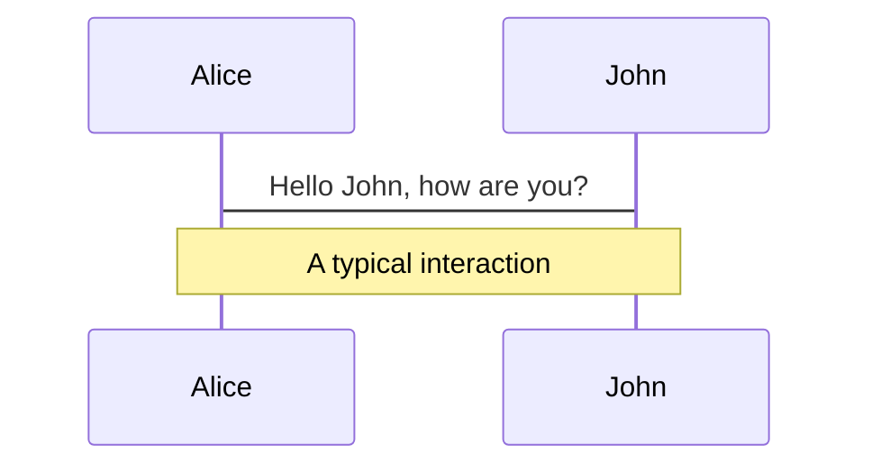
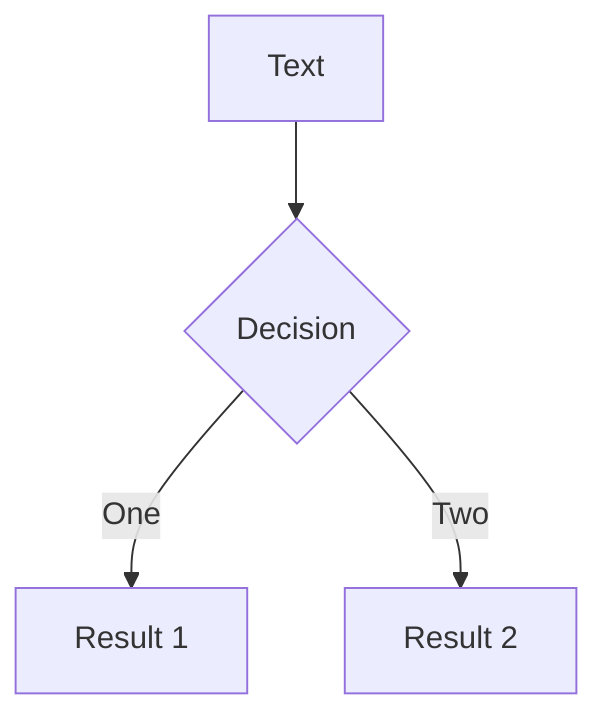
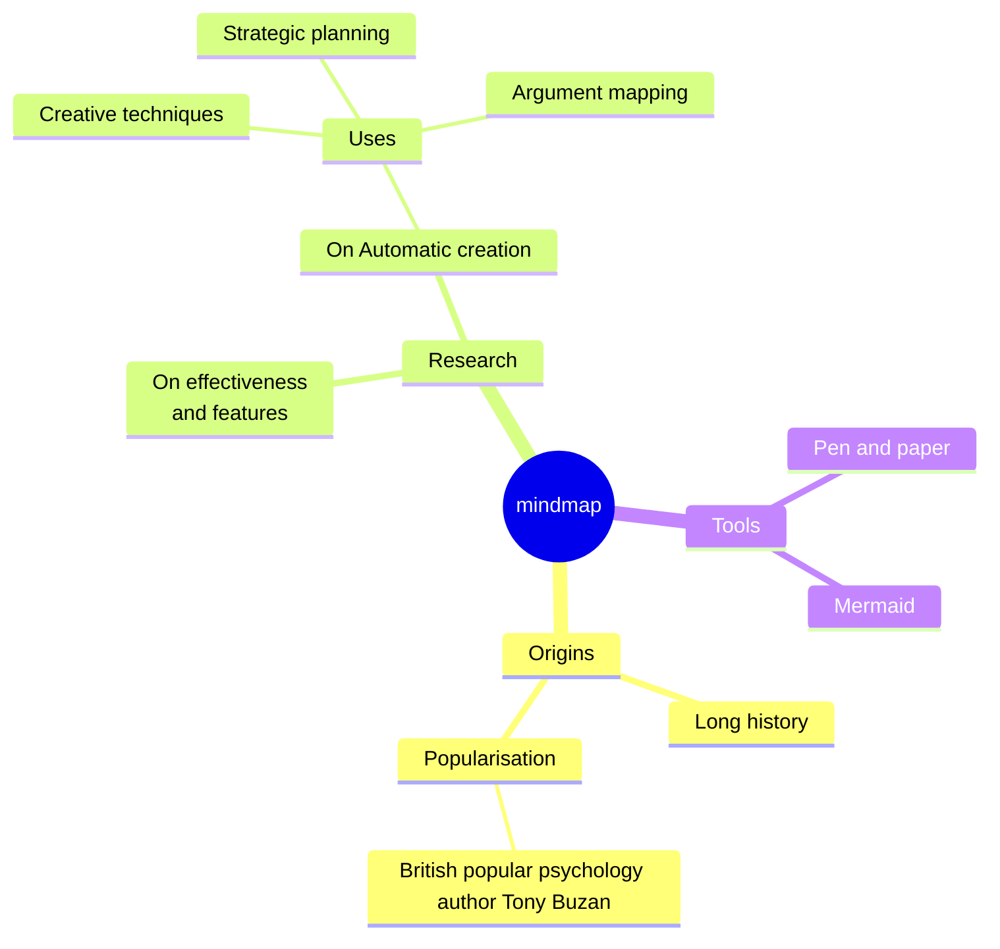
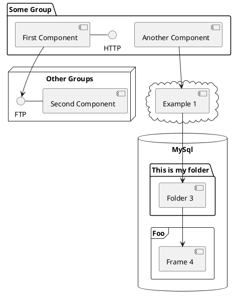

---
# try also 'default' to start simple
theme: dracula
title: 首页
info: |
  ## Slidev Starter Template
  Presentation slides for developers.

  Learn more at [Sli.dev](https://sli.dev)
# apply UnoCSS classes to the current slide
layout: cover
class: bg-blend-overlay bg-black65
# https://sli.dev/features/drawing
drawings:
  persist: false
# slide transition: https://sli.dev/guide/animations.html#slide-transitions
transition: slide-left
# enable MDC Syntax: https://sli.dev/features/mdc
mdc: true
# duration of the presentation
duration: 35min
---

<div class="center">
  	<h1 class="font-extrabold" style="line-height: 2rem !important;">减熵</h1>
  	<h3 class="font-300" style="opacity: 1;font-size: 12px">帆软软件有限公司 2025 年年度个人复盘</h3>
</div>

<div class="abs-bl ml-14 mb-12 flex items-center" >
	
	<div class="ml-3 flex flex-col text-left">
		<span class="text-2xl font-500">Alan</span>
		<span class="fs-10px">alan@fanruan.com</span>
	</div>
</div>

<div class="abs-br mr-6 mb-12">
    <span
      @click="$slidev.nav.next"
      class="arrow-container cursor-pointer text-white"
      hover="bg-altBlue bg-opacity-75 text-white"
    >
      <carbon:chevron-right class="inline" />
    </span>
</div>

<!--
大家好，我是 alan

下面开始我个人 2025 年的年度复盘

如果用一个关键字来形容我 2025 年的主要工作，那么 “减熵” 这个词最准确了。

什么是熵？

熵的概念最早起源于物理学，用于度量一个热力学系统的无序程度。热力学第二定律，又称“熵增定律”，表明了在自然过程中，一个孤立的系统总是从最初的集中、有序的排列状态，趋向于分散、混乱和无序；当熵达到最大时，系统就会处于一种静寂状态。
-->

---
transition: fade-out
---

# 软件开发中的熵

对于软件开发，熵代表系统的混乱、复杂、不确定性和不可控程度。随着代码量增长、需求变动、人员更替，整个系统的“熵”往往不可避免地增加，表现为：

- 代码可读性下降、耦合度上升；
- 文档滞后于开发实际情况；
- 测试可覆盖情况降低，bug 频发；
- 底层代码牵一发而动全身，无法适应业务需求变动；

<!--

-->

<style>
h1 {
  background-color: #2B90B6;
  background-image: linear-gradient(45deg, #4EC5D4 10%, #146b8c 20%);
  background-size: 100%;
  -webkit-background-clip: text;
  -moz-background-clip: text;
  -webkit-text-fill-color: transparent;
  -moz-text-fill-color: transparent;
}
</style>

<!--
Here is another comment.
-->

---
transition: slide-up
level: 2
title: 熵增公式
layout: center
clicks: 7
---

<FormulaExplainer :clicks="$clicks" />

<v-clicks v-show="false">
  <div v-for="i in 7" :key="i" />
</v-clicks>

<!--
正如热力学系统中随时间“自发熵增”的现象：如果没有额外的能量（如重构、标准化）投入，系统必然走向混乱。

熵增虽是必然趋势，但通过系统性干预可显著延缓其速度。即通过组织文化、技术架构、工程流程，持续引入秩序，减缓混乱的蔓延。

于是有人参考计算熵的玻尔兹曼公式来设计了软件工程的熵增公式：

通过这个公式我们可以看出，最终团队的熵值，是跟一系列参数的取值有关。
-->

---
layout: center
title: 能够解决熵减的三个方向
---

<div class="flex flex-col gap-10 w-full max-w-2xl mx-auto">
  <div class="flex items-center gap-8">
    <div 
      v-motion
      :initial="{ x: -50, opacity: 0 }"
      :enter="{ x: 0, opacity: 1, transition: { duration: 600 } }"
      class="text-7xl font-black w-24 text-center" 
      style="color: #ffb86c"
    >D</div>
    <div class="flex flex-col text-left">
      <div class="text-2xl font-bold mb-1" style="color: #ffb86c">减少技术复杂度</div>
      <div class="text-gray-400">通过标准化、组件化与持续重构，降低系统熵增速率</div>
    </div>
  </div>

  <div class="flex items-center gap-8">
    <div 
      v-motion
      :initial="{ x: -50, opacity: 0 }"
      :enter="{ x: 0, opacity: 1, transition: { duration: 600 } }"
      class="text-7xl font-black w-24 text-center" 
      style="color: #bd93f9"
    >T</div>
    <div class="flex flex-col text-left">
      <div class="text-2xl font-bold mb-1" style="color: #bd93f9">提升工具减熵因子</div>
      <div class="text-gray-400">建设高效的基建平台、自动化测试与 CI/CD 流程</div>
    </div>
  </div>

  <div class="flex items-center gap-8">
    <div 
      v-motion
      :initial="{ x: -50, opacity: 0 }"
      :enter="{ x: 0, opacity: 1, transition: { duration: 600 } }"
      class="text-7xl font-black w-24 text-center" 
      style="color: #ff5555"
    >P</div>
    <div class="flex flex-col text-left">
      <div class="text-2xl font-bold mb-1" style="color: #ff5555">优化开发模式成熟度</div>
      <div class="text-gray-400">推行敏捷、持续交付与沉淀良好的工程文化</div>
    </div>
  </div>
</div>

---
title: 组件基于 meta 的底层设计
layout: center
class: text-center
---

<div class="abs-tl m-10 flex items-center gap-2">
  <div class="w-3 h-3 rounded-full bg-[#ffb86c] shadow-[0_0_8px_#ffb86c]"></div>
  <div class="text-[#ffb86c] font-bold tracking-widest uppercase">减少技术复杂度 (D)：组件基于 meta 的底层设计</div>
</div>
<div class="flex flex-col items-center justify-center h-full">
  <div v-motion :initial="{ y: 40, opacity: 0 }" :enter="{ y: 0, opacity: 1, transition: { duration: 800, delay: 300 } }" class="max-w-2xl bg-white/5 p-10 rounded-3xl border border-white/10 backdrop-blur-md shadow-2xl relative overflow-hidden group">
    <div class="absolute top-0 right-0 -mt-4 -mr-4 w-24 h-24 bg-[#ffb86c]/5 rounded-full blur-3xl transition-all group-hover:bg-[#ffb86c]/10"></div>
    <div class="relative z-10 flex flex-col items-center gap-6">
      <p class="text-2xl leading-relaxed font-light italic text-gray-200">
        “由 <span class="text-[#ffb86c] font-medium">Meta</span> 指导基于 <span class="font-mono text-blue-400">TS 类型约束</span> 的组件底层架构设计”
      </p>
      <div class="w-16 h-1 bg-gradient-to-r from-transparent via-[#ffb86c] to-transparent opacity-50"></div>
    </div>
  </div>
</div>

---
layout: image-right
image: https://cover.sli.dev
---

# Code

Use code snippets and get the highlighting directly, and even types hover!

```ts [filename-example.ts] {all|4|6|6-7|9|all} twoslash
// TwoSlash enables TypeScript hover information
// and errors in markdown code blocks
// More at https://shiki.style/packages/twoslash
import { computed, ref } from 'vue'

const count = ref(0)
const doubled = computed(() => count.value * 2)

doubled.value = 2
```

<arrow v-click="[4, 5]" x1="350" y1="310" x2="195" y2="342" color="#953" width="2" arrowSize="1" />

<!-- This allow you to embed external code blocks -->
<<< @/snippets/external.ts#snippet

<!-- Footer -->

[Learn more](https://sli.dev/features/line-highlighting)

<!-- Inline style -->
<style>
.footnotes-sep {
  @apply mt-5 opacity-10;
}
.footnotes {
  @apply text-sm opacity-75;
}
.footnote-backref {
  display: none;
}
</style>

<!--
Notes can also sync with clicks

[click] This will be highlighted after the first click

[click] Highlighted with `count = ref(0)`

[click:3] Last click (skip two clicks)
-->

---
level: 2
---

# Shiki Magic Move

Powered by [shiki-magic-move](https://shiki-magic-move.netlify.app/), Slidev supports animations across multiple code snippets.

Add multiple code blocks and wrap them with <code>````md magic-move</code> (four backticks) to enable the magic move. For example:

````md magic-move {lines: true}
```ts {*|2|*}
// step 1
const author = reactive({
  name: 'John Doe',
  books: [
    'Vue 2 - Advanced Guide',
    'Vue 3 - Basic Guide',
    'Vue 4 - The Mystery'
  ]
})
```

```ts {*|1-2|3-4|3-4,8}
// step 2
export default {
  data() {
    return {
      author: {
        name: 'John Doe',
        books: [
          'Vue 2 - Advanced Guide',
          'Vue 3 - Basic Guide',
          'Vue 4 - The Mystery'
        ]
      }
    }
  }
}
```

```ts
// step 3
export default {
  data: () => ({
    author: {
      name: 'John Doe',
      books: [
        'Vue 2 - Advanced Guide',
        'Vue 3 - Basic Guide',
        'Vue 4 - The Mystery'
      ]
    }
  })
}
```

Non-code blocks are ignored.

```vue
<!-- step 4 -->
<script setup>
const author = {
  name: 'John Doe',
  books: [
    'Vue 2 - Advanced Guide',
    'Vue 3 - Basic Guide',
    'Vue 4 - The Mystery'
  ]
}
</script>
```
````

---

# Components

<div grid="~ cols-2 gap-4">
<div>

You can use Vue components directly inside your slides.

We have provided a few built-in components like `<Tweet/>` and `<Youtube/>` that you can use directly. And adding your custom components is also super easy.

```html
<Counter :count="10" />
```

<!-- ./components/Counter.vue -->
<Counter :count="10" m="t-4" />

Check out [the guides](https://sli.dev/builtin/components.html) for more.

</div>
<div>

```html
<Tweet id="1390115482657726468" />
```

<Tweet id="1390115482657726468" scale="0.65" />

</div>
</div>

<!--
Presenter note with **bold**, *italic*, and ~~striked~~ text.

Also, HTML elements are valid:
<div class="flex w-full">
  <span style="flex-grow: 1;">Left content</span>
  <span>Right content</span>
</div>
-->

---
class: px-20
---

# Themes

Slidev comes with powerful theming support. Themes can provide styles, layouts, components, or even configurations for tools. Switching between themes by just **one edit** in your frontmatter:

<div grid="~ cols-2 gap-2" m="t-2">

```yaml
---
theme: default
---
```

```yaml
---
theme: seriph
---
```


</div>

Read more about [How to use a theme](https://sli.dev/guide/theme-addon#use-theme) and
check out the [Awesome Themes Gallery](https://sli.dev/resources/theme-gallery).

---

# Clicks Animations

You can add `v-click` to elements to add a click animation.

<div v-click>

This shows up when you click the slide:

```html
<div v-click>This shows up when you click the slide.</div>
```

</div>

<br>

<v-click>

The <span v-mark.red="3"><code>v-mark</code> directive</span>
also allows you to add
<span v-mark.circle.orange="4">inline marks</span>
, powered by [Rough Notation](https://roughnotation.com/):

```html
<span v-mark.underline.orange>inline markers</span>
```

</v-click>

<div mt-20 v-click>

[Learn more](https://sli.dev/guide/animations#click-animation)

</div>

---

# Motions

Motion animations are powered by [@vueuse/motion](https://motion.vueuse.org/), triggered by `v-motion` directive.

```html
<div
  v-motion
  :initial="{ x: -80 }"
  :enter="{ x: 0 }"
  :click-3="{ x: 80 }"
  :leave="{ x: 1000 }"
>
  Slidev
</div>
```

<div class="w-60 relative">
  <div class="relative w-40 h-40">
    
    
    
  </div>

  <div
    class="text-5xl absolute top-14 left-40 text-[#2B90B6] -z-1"
    v-motion
    :initial="{ x: -80, opacity: 0}"
    :enter="{ x: 0, opacity: 1, transition: { delay: 2000, duration: 1000 } }">
    Slidev
  </div>
</div>

<!-- vue script setup scripts can be directly used in markdown, and will only affects current page -->
<script setup lang="ts">
const final = {
  x: 0,
  y: 0,
  rotate: 0,
  scale: 1,
  transition: {
    type: 'spring',
    damping: 10,
    stiffness: 20,
    mass: 2
  }
}
</script>

<div
  v-motion
  :initial="{ x:35, y: 30, opacity: 0}"
  :enter="{ y: 0, opacity: 1, transition: { delay: 3500 } }">

[Learn more](https://sli.dev/guide/animations.html#motion)

</div>

---

# $\LaTeX$

$\LaTeX$ is supported out-of-box. Powered by [$\KaTeX$](https://katex.org/).

<div h-3 />

Inline $\sqrt{3x-1}+(1+x)^2$

Block
$$ {1|3|all}
\begin{aligned}
\nabla \cdot \vec{E} &= \frac{\rho}{\varepsilon_0} \\
\nabla \cdot \vec{B} &= 0 \\
\nabla \times \vec{E} &= -\frac{\partial\vec{B}}{\partial t} \\
\nabla \times \vec{B} &= \mu_0\vec{J} + \mu_0\varepsilon_0\frac{\partial\vec{E}}{\partial t}
\end{aligned}
$$

[Learn more](https://sli.dev/features/latex)

---

# Diagrams

You can create diagrams / graphs from textual descriptions, directly in your Markdown.

<div class="grid grid-cols-4 gap-5 pt-4 -mb-6">









</div>

Learn more: [Mermaid Diagrams](https://sli.dev/features/mermaid) and [PlantUML Diagrams](https://sli.dev/features/plantuml)

---
foo: bar
dragPos:
  square: 691,32,167,_,-16
---

# Draggable Elements

Double-click on the draggable elements to edit their positions.

<br>

###### Directive Usage

```md

```

<br>

###### Component Usage

```md
<v-drag text-3xl>
  <div class="i-carbon:arrow-up" />
  Use the `v-drag` component to have a draggable container!
</v-drag>
```

<v-drag pos="663,206,261,_,-15">
  <div text-center text-3xl border border-main rounded>
    Double-click me!
  </div>
</v-drag>


###### Draggable Arrow

```md
<v-drag-arrow two-way />
```

<v-drag-arrow pos="67,452,253,46" two-way op70 />

---
src: ./pages/imported-slides.md
hide: false
---

---

# Monaco Editor

Slidev provides built-in Monaco Editor support.

Add `{monaco}` to the code block to turn it into an editor:

```ts {monaco}
import { ref } from 'vue'
import { emptyArray } from './external'

const arr = ref(emptyArray(10))
```

Use `{monaco-run}` to create an editor that can execute the code directly in the slide:

```ts {monaco-run}
import { version } from 'vue'
import { emptyArray, sayHello } from './external'

sayHello()
console.log(`vue ${version}`)
console.log(emptyArray<number>(10).reduce(fib => [...fib, fib.at(-1)! + fib.at(-2)!], [1, 1]))
```

---
layout: center
class: text-center
---

# Learn More

[Documentation](https://sli.dev) · [GitHub](https://github.com/slidevjs/slidev) · [Showcases](https://sli.dev/resources/showcases)

<PoweredBySlidev mt-10 />
